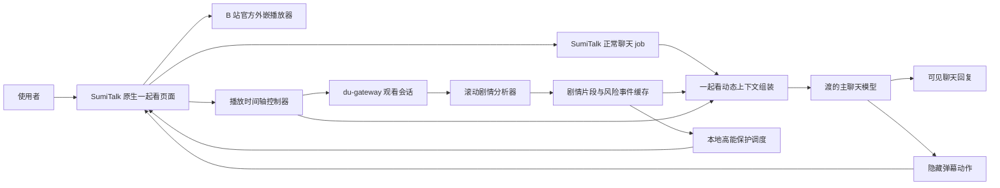

# SumiTalk 一起看方案

> 状态：Phase 1 基础链路已部署；Phase 2 分析后端已在本地实现并通过假上游回归，尚未提交、部署或完成真实影片验收。
>
> 目标端：SumiTalk 原生 Android App。
>
> 协作端：`du-gateway` 负责剧情分析、动态上下文和隐藏动作协议。
>
> 首个播放源：B 站允许公开分享的免费视频，使用官方外嵌播放器。

## 1. 产品定义

“一起看”不是在视频旁边附加一个聊天框，也不是预先生成一批像渡说的话。

核心体验是：

- 小玥和渡处在同一条播放时间线上。
- 渡知道已经看过什么、当前演到哪里，也能获得回复抵达前后即将出现的少量剧情。
- 渡仍在每次真实对话里自己决定怎么回复、要不要发弹幕；系统不提前替他写弹幕。
- 网络和模型延迟通过未来剧情窗口与目标时间戳消化，不能让弹幕长期落后于画面。
- 播放、剧情理解和聊天互相解耦。分析失败可以降级，但不能打断电影。

一句话边界：**官方播放器负责把电影稳定播出来，独立分析器负责让渡看见当前附近，主聊天模型负责当场说自己的话。**

## 2. 已确认的产品决策

1. 播放优先使用 B 站官方外嵌播放器，不让网关承担整部视频的解析和中转。
2. 分析器独立于播放器，滚动保持当前播放点之后约 5 分钟的剧情素材。
3. 每次聊天最多给渡注入后续 2 分钟剧情，不把整部作品或远期剧透塞进当前回合。
4. 弹幕不预生成，只能由渡在真实聊天回合中自行决定是否发出。
5. 播放前必须由使用者手动选择“陪伴者了解作品”或“陪伴者不了解/不确定”。系统不得探测、试探或替使用者判断。
6. 使用者应在进入一起看前先和陪伴者沟通，再根据沟通结果选择模式。
7. 了解模式不生成“大概摘要卡片”；不了解模式维护截至当前的累计剧情摘要和人物关系。
8. MVP 默认识图模型使用 OpenRouter 的 `google/gemini-2.5-flash`，关闭 thinking，并要求结构化输出。
9. 作品识别预检、正片边界、滚动剧情和高能判断使用同一个模型，不在 MVP 中混用 3.5/Lite 造成知识状态和人物识别漂移。
10. 识图分析模型是否认识作品是另一条独立状态，不能和陪伴者知识模式混为一谈；播放前由分析流程确认并展示结果。
11. 识图模型认识作品时可以降低基础截图密度，但仍要用实际画面、字幕和版本信息定位，不能靠模型记忆猜时间点。
12. 完整剧情识图前先建立正片边界；纯片头、纯片尾、前情回顾和下集预告不按新剧情重复分析。
13. 冷开场、字幕叠在剧情上的开场、片尾仍在继续的剧情和片尾彩蛋属于正片，不能因为出现演职员表就跳过。
14. 胆小模式是独立开关，可以和两种知识模式任意组合；开启后允许提前进行高能预警和画面遮挡。
15. 未来剧情、风险预判和分析截图是临时运行素材，不进入长期记忆。
16. 首版只支持公开、可正常分享播放的内容，不绕过会员、付费、地区、版权或 DRM 限制。

## 3. 本期范围与非目标

### 3.1 本期范围

- 原生 App 内的专用一起看播放器。
- B 站分享链接识别、作品/分 P 确认和官方播放器加载。
- 播放前模式确认。
- 播放时间同步、暂停、继续、拖动、倍速和退出处理。
- 片头、片尾、前情回顾、下集预告和片尾彩蛋的时间段切分。
- 低频截图/字幕分析与滚动剧情窗口。
- 正常聊天中的一起看动态上下文。
- 渡的定时弹幕动作。
- 胆小模式的高能预警与可关闭遮挡层。
- 进度、模式和真实共同观看记录的本地保存。
- 播放与分析故障的明确降级。

### 3.2 本期不做

- 不下载或长期保存完整视频。
- 不代理整部视频流量。
- 不破解 B 站付费、登录、地区或版权限制。
- 不提前批量生成渡的弹幕、聊天台词或反应。
- 不把分析模型写出的剧情描述伪装成渡说的话。
- 不让后台分析结果直接进入动态记忆、画像或对话归档。
- 不复用当前一起听的音频 `MediaPlayer` 作为视频播放器。
- 不以旧 MiniApp/WebView 主界面为产品入口。

## 4. 播放前流程

### 4.1 标准流程

1. 使用者先在正常聊天中和陪伴者沟通，确认对方是否了解要看的作品、季集和版本。
2. 使用者在一起看页面粘贴 B 站分享链接，或从观看记录中选择作品。
3. App 展示解析出的作品名、年份（能获得时）、分 P/季集、时长和来源，要求使用者确认没有选错版本。
4. App 要求手动选择知识模式；未选择时“开始一起看”不可用。
5. 识图分析模型用作品元数据和首批可用素材确认自己是否认识该作品；App 展示“认识 / 部分认识 / 按陌生作品分析”的结果。
6. 使用者可额外开启胆小模式并选择预警方式。
7. App 检查播放器可用性和首段分析缓冲。
8. 条件满足后创建观看会话并开始播放。

第 4 步只处理陪伴者知识模式：不得调用模型询问“渡知不知道这部作品”，也不得根据陪伴者模型自报置信度自动选择。

第 5 步处理的是分析工具自身的识别能力，可以自动执行，但不能只接受一句“我知道”。结果必须同时核对作品名、年份、季集/版本以及首批画面或字幕；无法确认时按陌生作品分析。

### 4.2 播放前确认界面

界面文案中的“渡”使用当前陪伴者显示名，不在开源代码中写死。

```text
开始一起看前，请确认渡是否了解这部作品

○ 渡了解这部作品
  不生成剧情摘要，只提供当前定位和附近剧情。

○ 渡不了解或不确定
  启用人物关系与截至当前的剧情摘要。

□ 胆小模式
  高能片段前提醒我，可按设置暂时挡住画面。

识图分析：认识这部作品 / 按陌生作品分析

[返回聊天确认]                         [开始一起看]
```

知识模式按“陪伴者 + 作品 + 季集/分 P + 版本”保存。继续上次观看时展示原选择，但仍允许在开始前修改。

### 4.3 中途继续

- 了解模式：定位作品和时间点后即可恢复。
- 不了解模式：必须先具备从开头到恢复位置的“剧情截至当前”摘要，不能只给当前几张截图。
- 识图模型不认识作品：必须恢复分析器自己的累计剧情状态，不能把中途一张截图当成完整上下文。
- 胆小模式：必须先覆盖恢复位置之后的最小安全窗口，避免一恢复就撞上未分析的高能片段。
- 如果准备条件不满足，可以单独播放，但“一起看已同步”状态不能假装就绪。

## 5. 四个互相独立的会话维度

### 5.1 知识模式

`knowledge_mode = known | needs_summary`

#### `known`：陪伴者了解作品

注入：

- 精确作品身份和版本。
- 用户消息发出时的播放位置。
- 当前附近的客观画面/对白描述。
- 与本轮对话相关的已观看片段。
- 后续最多 2 分钟、带时间戳的客观剧情描述。

不注入：

- 整部作品的大概摘要卡片。
- 用分析模型重述一遍陪伴者已经知道的世界观和人物关系。
- 与当前场景无关的大段知识库背景。

这里省掉的是全局补课，不是场景定位。即使陪伴者知道作品，也仍需要时间点和当前画面来确认“现在具体演到哪”。

#### `needs_summary`：陪伴者不了解或不确定

在上述定位素材之外，额外维护：

- `story_so_far`：严格截止当前播放点的剧情进展。
- `character_map`：人物名字、称呼、外貌特征和身份对应。
- `relationship_state`：当前已经揭示的人物关系与立场。
- `active_goals`：当前正在推进的目标和冲突。
- `open_threads`：已经出现但尚未解决的信息。

摘要必须随播放进度滚动更新，不能一次写死；不能把未来 2 分钟混入“已经发生”。

### 5.2 识图分析模型的作品识别状态

`analysis_familiarity = recognized | partial | unknown`

这是分析工具的能力状态，不是渡的知识模式，也不由使用者替模型回答。

播放前的识别预检至少输入：

- 作品名、年份、季集、分 P 和来源标题。
- 首批实际画面或字幕。
- 能获得时的演员/角色、时长和版本信息。

分析模型返回：

- `canonical_identity`：它认为对应的标准作品与季集。
- `familiarity`：`recognized`、`partial` 或 `unknown`。
- `confidence`：识别置信度。
- `evidence`：用来确认没有认错同名作品、翻拍版或剪辑版的简短依据。

`partial` 和无法通过实际素材核对的 `recognized` 都按 `unknown` 的保守路径运行。界面可以展示识别结果，并允许使用者手动降级为“按陌生作品分析”，但不能手动强行升级成“模型认识”。

#### `recognized`：分析模型认识作品

- 可以利用已有作品知识理解人物、前因后果和场景位置。
- 基础截图密度可以降低，优先用字幕、镜头变化和关键时间点补帧。
- 仍必须根据实际画面和当前版本校准时间轴；模型记得剧情不等于知道 B 站这个视频的准确剪辑位置。
- 不得仅凭知识库写出当前尚未播放或没有被取样确认的细节。

#### `unknown`：分析模型不认识作品

- 提高基础截图密度，并更依赖带时间戳字幕和镜头变化。
- 分析器内部维护 `analysis_story_state`、人物临时标识、场景连续性和未解决事件，供后续片段理解。
- 中途开始或向前 seek 时，先补齐从开头到目标位置的分析状态；不能只看当前片段后猜前因。
- 人名无法确认时先使用稳定的外观/身份标识，得到明确证据后再合并，不能为了流畅乱认角色。

#### 两条知识轴的组合

| 陪伴者 | 识图模型 | 行为 |
| --- | --- | --- |
| 了解 | 认识 | 轻量定位；不给陪伴者大概摘要卡片 |
| 了解 | 不认识 | 分析器内部滚动补上下文，但仍不给陪伴者大概摘要卡片 |
| 不了解 | 认识 | 分析器利用作品知识生成截至当前的摘要卡片 |
| 不了解 | 不认识 | 高密度取样并从头维护分析状态，再生成截至当前的摘要卡片 |

分析器的 `analysis_story_state` 和给陪伴者的 `story_so_far` 是两份不同用途的数据。前者帮助识图模型连续理解，后者只在 `knowledge_mode = needs_summary` 时注入主聊天。

### 5.3 胆小模式

`fear_mode = off | on`

胆小模式不是第三种知识模式。它与 `known`、`needs_summary` 正交，任何作品都可以单独开启。

开启后，分析器除剧情片段外还要输出高能事件：

- 突发惊吓或 jumpscare。
- 突然出现的恐怖形象。
- 明显血腥、肢体伤害或令人不适的特写。
- 音画突然增强且可能造成惊吓的片段。
- 其他由用户敏感级别覆盖的内容。

预警只描述风险强度和预计持续时间，不提前说出“谁出现了、谁受伤了、发生了什么”等剧情答案。

#### 预警方式

MVP 提供两档：

- `warn_only`：提前显示渡的轻量提醒，不遮挡画面。
- `cover_video`：提前显示遮挡层盖住播放器，风险区间过去后自动解除；使用者可以随时点“我还是要看”提前关闭。

“同时降低声音”作为独立选项，默认关闭，不能在未告知时擅自修改系统音量。

遮挡层应由原生 App 本地按风险时间戳执行。渡的提醒文案可以提前准备，但遮挡时机不能依赖一次可能迟到的聊天请求。

#### 胆小模式的可靠性边界

- 风险覆盖不足时不能静默失效。
- 如果未来安全窗口低于最低阈值，App 暂停“一起看保护”并明确显示“高能分析暂时没跟上”。
- 使用者可以选择等待分析、关闭胆小模式或明确继续播放。
- 拖动到尚未分析的位置时，必须先提示保护暂不可用；拖动到已知风险区间时，在恢复画面前先显示遮挡层。
- 误报可以手动关闭；漏报需要保留本地反馈入口，供后续调整检测阈值。

### 5.4 弹幕显示

弹幕显示开关只控制画面展示，不改变渡是否产生了观看反应，也不改变聊天回复。

- 关闭弹幕时，定时反应可以进入“片段评论”历史，但不飘过画面。
- 打开弹幕后，只显示当前会话且目标时间有效的弹幕。
- B 站原生弹幕和渡的弹幕分别控制，不捆绑开关。

## 6. 总体架构



### 6.1 播放域

- 原生 App 使用专用 WebView 加载 B 站官方外嵌播放器。
- WebView 只承担这一项播放能力，不复用通用浏览器的地址栏、历史和渡控制模式。
- 播放会话必须能读取当前 `currentTime`、播放/暂停状态、duration 和倍速，并监听 seek。
- 全屏时播放器、渡的弹幕层和胆小模式遮挡层必须进入同一个原生全屏容器。
- B 站 Cookie 和登录态留在设备 WebView，不上传原始 Cookie。
- 网关分析公开片源不读取设备登录态；仅登录可见的解析兜底使用隔离的网关专用 Cookie，从 `WATCH_ANALYSIS_BILIBILI_COOKIE` 密钥配置读取，不写入运行库或日志。

### 6.2 分析域

- 分析器不参与前台播放，不把视频流经网关转发给手机。
- MVP 默认通过 OpenRouter 调用 `google/gemini-2.5-flash`，thinking 关闭；识别预检、时间段切分、剧情描述和风险事件共用同一模型基线。
- 请求使用结构化 JSON schema，输出保持短小；不能让模型用长篇解释消耗输出 token。
- 首版允许使用可替换的视频解析适配器取得低频截图、字幕或时间轴素材。
- 解析器只承担分析取样；它失败时播放器仍能继续。
- 分析结果按作品身份、版本、时间范围和分析版本缓存，临时播放 URL 不作为长期数据保存。
- 视觉模型把采样画面、字幕和补充文字组织成自然连贯的剧情短段，不写成逐帧动作流水账，也不生成渡的聊天内容。
- 剧情事实是主体，同时保留场景、动作、互动、角色神情、目光、姿态和身体反应；允许基于可见画面与明确声音信息做少量氛围和情绪润色。
- 氛围润色不能改变或夸大事实。模型不得输出个人喜恶、审美评价、观后感或创作者意图，也不得把未被画面、对白和前序状态支持的人物内心、动机与因果写成事实。

### 6.3 聊天域

- 一起看聊天继续走 SumiTalk 正常聊天 job 和统一提示词/记忆主链路。
- App 在发送消息时附带 `watch_session_id` 和准确的发送时播放快照。
- 网关从观看会话读取对应剧情窗口，组装成 `__dynamic__` system 内容。
- 不新增一条人格不一致的“电影专用机器人回复”链路。
- 动态观看上下文在归档前剥离，不能污染用户消息正文或对话历史。

### 6.4 原生前端模块边界

前端不承载剧情推理，但必须成为播放时间轴的唯一事实来源。建议拆成以下模块：

```text
TogetherWatchScreen
  组合播放器、聊天抽屉、渡弹幕层、胆小模式遮挡层和状态提示

BilibiliEmbedController
  创建受限 WebView、加载官方播放器、读取视频状态和处理全屏

WatchPlaybackRuntime
  对外暴露统一播放状态，不让 Compose 页面直接操作 WebView DOM

WatchTimelineCoordinator
  校准媒体时间、识别 seek、维护 timeline epoch、生成聊天快照

WatchDanmakuScheduler
  按 session_id、epoch 和 target_ms 调度渡的弹幕动作

FearProtectionController
  按风险区间显示提醒、遮挡和可选降音量状态

WatchSessionRepository
  本地保存模式、进度、边界纠正、已显示弹幕和恢复信息

WatchGatewayClient
  创建/更新会话、上报播放状态、读取分析覆盖和接收 typed event
```

模块之间只传结构化状态和事件。`TogetherWatchScreen` 不自行推算播放进度，`WatchGatewayClient` 也不能直接控制 WebView。

### 6.5 WebView 播放桥接协议

MVP 优先使用 `evaluateJavascript` 读取最小视频状态，并把 B 站 DOM 差异封装在 `BilibiliEmbedController` 内。业务层不能散落 `querySelector("video")` 等站点细节。

读取结果：

```json
{
  "ready": true,
  "current_time_ms": 190250,
  "duration_ms": 7200000,
  "paused": false,
  "ended": false,
  "playback_rate": 1.0,
  "video_width": 1920,
  "video_height": 1080,
  "sampled_at_elapsed_ms": 8512250
}
```

桥接规则：

- 前台播放中每 500 到 1000ms 读取一次真实状态；暂停和后台时降低频率或停止轮询。
- 页面 ready、play、pause、ended、倍速变化和 seek 完成时立即额外采样。
- `sampled_at_elapsed_ms` 使用设备单调时钟，只用于判断样本新旧，不能代替媒体时间。
- 读取失败不能继续无限外推；短暂失败保留最后样本，超过阈值后进入“时间同步不可用”。
- 只允许官方播放器 origin 和必要子资源；跳转到其他页面时中止一起看会话或交给外部浏览器。
- 不向页面暴露网关 token、设备凭据或通用原生执行接口。
- 如后续改用 WebMessage，应使用 origin allowlist 和单一状态消息协议，不能注册可执行任意方法的 JS bridge。

MVP 可以继续使用 B 站自身播放控件。自定义播放按钮、自动跳片头或远程控制播放器不是读取时间轴的前提。

### 6.6 WebView 全屏与原生覆盖层

- 通过 `WebChromeClient.onShowCustomView/onHideCustomView` 接管 B 站 HTML5 全屏。
- 全屏容器中按固定层级放置：播放器、渡弹幕、胆小模式遮挡、退出/安全控制。
- 弹幕和遮挡不能作为 WebView 内 HTML 注入，避免随 B 站页面更新一起失效。
- 进入/退出全屏、横竖屏切换时保留同一个 `WatchPlaybackRuntime`，不能重建会话或重复播放。
- 系统返回键优先退出全屏，其次关闭聊天抽屉，最后才退出一起看。
- 遮挡层覆盖视频画面时仍要保留“我还是要看”和退出入口；普通弹幕不能盖住安全按钮。

### 6.7 前端状态机

播放状态和分析状态分开维护，不能用一个 `loading` 混在一起。

播放状态：

```text
idle
  -> preparing_player
  -> awaiting_mode_confirmation
  -> buffering_initial_context
  -> ready
  -> playing <-> paused
  -> seeking -> playing/paused
  -> recovering -> playing/paused
  -> ended
  -> playback_failed
```

分析状态：

```text
idle
  -> identifying_media
  -> detecting_timeline_sections
  -> warming_context
  -> ready
  -> lagging
  -> unavailable
```

胆小模式另有保护状态：

```text
off | protected | coverage_low | covering | user_bypassed
```

组合规则：

- `analysis = unavailable` 不自动把 `playback = playing` 改成失败。
- 胆小模式开启且 `coverage_low` 时必须显示明确选择，不能只在角落放一个灰点。
- 模式确认之前不能进入“一起看已同步”，即使 B 站视频已经加载成功。
- 只有播放器时间、会话 ID 和分析窗口都对应同一个媒体版本时才显示 ready。

### 6.8 时间轴 epoch 与状态上报

`WatchTimelineCoordinator` 以 WebView 的真实媒体时间为准，并维护递增的 `timeline_epoch`。

以下情况创建新 epoch：

- 用户 seek 到明显不同的位置。
- 切换分 P、季集、片源或版本。
- WebView 回收后恢复出的进度与旧进度不连续。
- 播放器重新加载后无法证明仍是同一条连续时间轴。

新 epoch 创建时：

- 取消旧 epoch 的待显示弹幕和风险调度。
- 立即上报新的播放快照。
- 重新读取当前片段和未来分析窗口。
- `needs_summary` 模式按新位置校准 `story_so_far`。

上报策略：

- play、pause、seek、倍速、进入后台、恢复前台和 ended 立即上报。
- 连续播放时每 3 到 5 秒节流上报一次，用于推动网关分析窗口。
- 用户发送聊天消息时原子读取最新播放器样本，单独生成 `watch_snapshot`；不能复用几秒前的心跳数据。
- 网络恢复后先上报完整状态，再补普通心跳。

### 6.9 弹幕与高能事件本地调度

弹幕队列按 `(session_id, timeline_epoch, target_ms, action_id)` 去重和排序。

- 调度器每次使用媒体时间比较目标，不使用“收到动作后延迟多少秒”。
- 暂停时媒体时间不前进，队列自然冻结，不需要重算所有计时器。
- 倍速变化后无需修改 `target_ms`。
- seek 后旧 epoch 队列整体失效。
- 目标刚错过时按迟到阈值处理；明显错过时转片段评论。
- App 重启后默认不恢复未显示的旧弹幕，避免过期反应突然出现。

高能风险队列使用同一媒体时间，但与渡弹幕分开：

- 风险遮挡是本地可靠动作，不等待聊天 SSE。
- 用户关闭某次遮挡后记录 `risk_id` 的本次会话 bypass 状态。
- 风险结束后自动解除；异常退出时也必须清理覆盖层和临时音量状态。
- 如果启用了降低音量，只修改 App 自己的播放器音量，并在风险结束、退出或崩溃恢复时还原；不修改系统全局音量。

### 6.10 当前画面截取（备用）

分析主链由网关的视频解析适配器按播放时间取低频画面，不要求 App seek 到未来位置截图。App 当前可见画面截图只作为手动诊断或解析源失效时的备用输入，不做连续录屏：

- 优先验证 `PixelCopy`/窗口合成能否获得包含视频的非黑屏画面。
- 截图在本地立即缩小到分析所需分辨率并压缩，上传完成后删除临时文件。
- 不截取聊天抽屉、通知、状态栏或其他 App 内容。
- 只有活跃一起看会话可以上传当前画面，后台和锁屏时拒绝。
- 若 WebView 视频层无法稳定截图，前端不偷偷申请 MediaProjection；继续使用独立分析源，并把当前截图能力标为不可用。

### 6.11 本地恢复契约

本地至少保存：

- 当前作品、分 P/季集、版本和官方播放器 URL。
- `session_id`、知识模式、识图熟悉度、胆小模式和弹幕开关。
- 最后确认的 playhead、duration、倍速、timeline epoch 和更新时间。
- 片头片尾人工纠正、已显示弹幕、风险 bypass 和片段评论。

恢复顺序：

1. 重建专用 WebView 并加载同一媒体。
2. 等待播放器 ready 后 seek 到本地进度。
3. 读取真实状态并创建新的 timeline epoch。
4. 向网关恢复或重建观看会话。
5. 分析窗口重新 ready 后才恢复“一起看已同步”。

不能先恢复旧弹幕队列再校准媒体时间，也不能因为本地有旧 `session_id` 就假设服务器会话仍然有效。

## 7. 滚动分析窗口

### 7.1 窗口定义

默认参数：

- 分析目标：始终覆盖 `playhead + 5 分钟`。
- 每轮聊天未来注入上限：`message_playhead + 2 分钟`。
- 已观看片段：按本轮语义检索，不把从开头到当前的全部片段逐条塞入 Prompt。
- 当前定位片段：覆盖播放点前后短窗口，具体秒数由画面密度调整。

```text
已观看剧情与相关片段 ← 当前播放点 → 可注入的未来 2 分钟 → 分析缓冲余量
```

5 分钟是分析缓存，2 分钟是主模型可见上限，两者不能混为一谈。

### 7.2 分析素材

优先组合：

1. 带时间戳字幕或对白。
2. 低频关键帧。
3. 镜头变化处的补充帧。
4. 作品名、季集、分 P、时长和版本元数据。

固定逐秒截图成本高且重复。`recognized` 可以从每 10 到 15 秒一帧的低密度取样起步，在镜头突变、高能候选或定位不确定时补帧；`unknown` 应使用更密的基础取样，并根据人物、场景和字幕连续性动态调整。具体间隔必须用真实影片实测，不能把两种识别状态写死成同一密度。

### 7.3 正片边界与片头片尾跳过

片头片尾识别是完整剧情分析之前的廉价切分层，不让主识图模型逐张重复判断。

#### 第一次观看某个版本

1. 对视频开头和结尾做稀疏预扫，默认只覆盖前后约 10 分钟，每 2 到 3 秒取一帧。
2. 把带时间戳的缩略图、可用字幕和作品元数据一次交给分析模型。
3. 模型输出连续的 `TimelineSection`，并给出边界置信度和判断依据。
4. 只有高置信度的纯非剧情区间才加入跳过识图表；无法确认的区间继续按正片处理。
5. 边界两侧保留约 1 秒保护余量，宁可多分析几帧，也不能吞掉剧情。

时间段类型：

```text
recap              前情回顾，不算本集新发生剧情
cold_open          片头前的冷开场，属于正片
intro              纯片头/标题序列，跳过完整剧情识图
content            正片
credits_over_story 演职员字幕叠在仍然推进的剧情上，属于正片
outro              纯片尾/滚动字幕，跳过完整剧情识图
preview            下集预告，完全排除出当前集剧情和未来窗口
post_credit        片尾彩蛋，属于正片
non_story          上传者片头、片尾或其他明确非作品内容
unknown            无法可靠判断，按正片分析
```

#### 连续剧复用

- 第一集确认出的片头/片尾画面做感知哈希模板。
- 后续集先用画面哈希匹配重复 OP/ED；分析源能取得音频时再叠加音频指纹。
- 匹配成功后只需确认边界，不再为整段重复调用视觉模型。
- 模板按作品、季度、片源版本和 CID 保存；换剪辑版或特别篇不能直接套用旧边界。

#### 各区间的处理

- `intro`、`outro`、`non_story`：不生成逐片段剧情描述，不进入人物/事件状态；播放到这里时只给主聊天一个简短状态，例如“当前正在看片头”。
- `recap`：可以帮助陌生分析模型恢复人物身份，但标记为回顾内容，不能当作本集新事件写进 `story_so_far`。
- `preview`：不进入当前、未来或高能预警上下文，避免下一集剧透。
- `cold_open`、`content`、`credits_over_story`、`post_credit`、`unknown`：正常识图、摘要和风险检测。

片头片尾“跳过识别”不等于自动跳过播放。是否提供“自动跳过片头/片尾”属于独立播放器设置，默认不因分析优化替使用者 seek。

#### 手动纠正

播放器提供“这段是片头 / 片尾 / 正片”的轻量纠正入口：

- 手动纠正立即更新本次会话的边界。
- 已经错误进入摘要的新事件要从受影响区间重新计算，不能只改标签。
- 纠正结果按作品和具体片源版本缓存，后续集只作为候选模板使用。
- 自动结果和人工纠正都保留来源，人工结果优先。

### 7.4 正片边界结构

```json
{
  "section_id": "section_xxx",
  "media_id": "bili:BVxxxx:cid",
  "start_ms": 0,
  "end_ms": 86500,
  "kind": "intro",
  "confidence": 0.94,
  "source": "vision_prepass",
  "analysis_policy": "skip_full_analysis"
}
```

### 7.5 分析片段结构

```json
{
  "chunk_id": "plot_xxx",
  "media_id": "bili:BVxxxx:cid",
  "start_ms": 120000,
  "end_ms": 135000,
  "description": "客观描述这一段可见剧情",
  "dialogue_summary": "必要时概括对白，不长篇转录",
  "characters": ["人物标识"],
  "location": "场景",
  "confidence": 0.86,
  "analysis_version": "v1"
}
```

### 7.6 高能事件结构

```json
{
  "risk_id": "risk_xxx",
  "media_id": "bili:BVxxxx:cid",
  "start_ms": 186500,
  "end_ms": 194000,
  "warn_at_ms": 179500,
  "risk_type": "jumpscare",
  "severity": 3,
  "confidence": 0.91,
  "spoiler_free_hint": "前面会突然吓一下，我先替你挡着。"
}
```

风险数据不携带面向用户的剧情答案。`warn_at_ms` 根据风险类型和持续时间计算，不能统一写死为同一个提前量。

即使 `analysis_familiarity = recognized`，高能事件也必须由当前版本的实际未来画面/音频特征确认。模型记忆中的情节和时间点只能帮助找候选，不能直接触发遮挡。

## 8. Prompt 上下文与剧透隔离

### 8.1 四层上下文

一次一起看聊天回合拆成四层：

1. `session_identity`：作品、版本、知识模式、播放状态。
2. `visible_story`：用户已经看到的剧情，截止 `message_playhead_ms`。
3. `current_scene`：用户发消息时正在发生的片段。
4. `scheduled_future`：未来最多 2 分钟、带明确目标时间的片段，只供定时观看反应使用。

`needs_summary` 模式在 `visible_story` 中额外加入摘要卡片；`known` 模式明确省略该卡片。

### 8.2 主回复和未来反应分权

- 可见聊天回复只能依据 `visible_story + current_scene` 回应用户当下的话。
- `scheduled_future` 不能出现在当前回复正文，不能用“马上会……”“等下你就知道”等方式泄露。
- 渡如果想对未来片段产生反应，只能输出带 `target_ms` 的隐藏弹幕动作。
- 同一回合可以只有聊天、只有弹幕、两者都有，或什么动作都没有；系统不能要求每轮强制发弹幕。
- 模型看到了未来片段，不代表角色在当前可见回复里已经经历了它。

### 8.3 动态上下文示意

```text
【一起看会话】
作品：……
知识模式：渡了解这部作品
用户发消息时播放位置：00:31:42
当前状态：播放中 / 1.0x

【截至当前已经可见】
……

【当前片段】
[00:31:35-00:31:50] ……

【仅供定时弹幕的未来片段，禁止写进当前聊天正文】
[00:32:18-00:32:35] ……
[00:33:01-00:33:20] ……
```

## 9. 渡的弹幕动作协议

### 9.1 不使用裸 JSON 正文

动作必须使用统一隐藏块，由网关在流式过程中剥离并转换为 typed event。原始 JSON 绝不能出现在聊天气泡里。

建议标记：

```text
<<<DU_WATCH_ACTION>>>
{"type":"danmaku","session_id":"watch_xxx","target_ms":193500,"text":"……"}
<<<END_DU_WATCH_ACTION>>>
```

客户端事件建议使用 `watch_danmaku_action`，而不是复用主动消息的 `send_message`。弹幕动作只属于当前观看会话，不需要 `wechat`、`qq` 等消息 channel。

### 9.2 动作校验

网关和 App 都要校验：

- `session_id` 必须仍是当前活跃会话。
- `target_ms` 必须落在本轮允许的未来窗口内。
- `text` 不能为空并限制长度。
- 同一个动作 ID 只能消费一次。
- 已结束或切换作品的会话拒绝旧动作。
- 动作隐藏块必须从可见回复、对话归档和通知预览中移除。

### 9.3 迟到策略

- 目标时间尚未到：进入本地定时队列。
- 目标时间刚过去且仍属于同一短片段：允许立即显示。
- 已明显错过场景：不硬飘到错误画面，转存为该时间点的片段评论。
- 暂停时：队列冻结。
- 退出会话时：未消费动作取消，不跨作品续发。

迟到阈值在实现阶段通过真实模型延迟实测确定，不能先凭感觉写死。

## 10. 高能预警协议

高能保护分为两个层次：

1. 分析器产生确定性的 `WatchRiskEvent`，App 本地按时间执行遮挡，保证可靠性。
2. 陪伴者可以为风险事件准备一句自然提醒，失败时使用本地中性兜底文案；文案生成失败不能影响遮挡。

遮挡层需要：

- 完整覆盖视频画面，但保留播放器外的退出和安全控制。
- 显示无剧透提醒和预计剩余时间。
- 提供“我还是要看”关闭按钮。
- 风险区间结束后自动解除。
- 用户主动关闭后，本次风险事件不重复弹出。
- seek 重新进入同一风险事件时，根据“本次会话已忽略”状态决定是否再次提醒。

胆小模式事件是观看保护事件，不走微信/QQ/SumiTalk 主动消息通道，也不能因为 channel 选择错误而显示成一段动作 JSON。

## 11. 播放时间轴规则

### 11.1 播放和暂停

- 播放中持续更新本地 playhead，并按低频节流上报网关以推进分析窗口。
- 暂停后停止推进预计 playhead，冻结弹幕和风险事件倒计时。
- 恢复时以 WebView 真实 `currentTime` 为准，不能只用本地墙上时间累加。

### 11.2 拖动

- seek 完成后立即建立新的时间轴 epoch。
- 旧 epoch 中尚未显示的弹幕全部失效。
- 网关按新位置重建当前/未来窗口。
- 向前拖动时，`needs_summary` 模式先补齐截止新位置的摘要。
- 向后拖动时，已发生剧情边界回退到新位置；未来信息不能继续冒充已观看内容。

### 11.3 倍速

- 所有动作按媒体时间 `target_ms` 调度，不按请求后经过的真实秒数调度。
- 未来分析缓存以媒体时间计算；2 倍速时 5 分钟缓存只能支撑约 2.5 分钟现实时间，需要更积极补充。

### 11.4 前后台与断线

- App 进入后台时明确上报播放状态；不能假设 WebView 一定继续播放。
- WebView 渲染进程被回收后，按作品、分 P 和本地进度恢复。
- 断网时已加载视频是否继续由播放器决定；聊天和分析显示离线状态，不伪造同步。
- 重连后先校准真实 playhead，再恢复分析和动作队列。

## 12. 数据与存储边界

### 12.1 原生 App 本地保存

- 作品身份、分享链接和分 P/季集。
- 陪伴者 ID 和显示名。
- 用户手选的知识模式与胆小模式设置。
- 识图模型最后确认的作品身份、识别状态、分析版本和用户手动降级选择。
- 片头片尾边界、人工纠正结果和可复用的片源版本标识。
- 最后播放位置、时长和播放状态。
- 已实际显示的渡弹幕和片段评论。
- 用户对高能事件的忽略/反馈状态。

### 12.2 网关临时保存

- 活跃观看会话和最近 playhead。
- 分析任务状态。
- 带版本的正片边界、剧情片段、累计摘要和风险事件。
- 尚在有效期内的动作去重信息。

默认优先使用本地 SQLite/短期缓存，不因本功能直接写共享 R2。是否跨设备同步应另行设计和授权。

### 12.3 可以进入长期共同记忆的内容

- 确实一起看过的作品和观看日期。
- 已经播放到的进度。
- 双方真实聊过的内容。
- 已经实际显示并发生互动的弹幕或重要片段。

### 12.4 禁止进入长期记忆的内容

- 尚未播放到的未来剧情。
- 高能预判结果。
- 原始分析截图、临时视频 URL 和 Cookie。
- 为定位场景生成的中间视觉描述。
- 未实际显示的候选弹幕动作。

## 13. 数据结构草案

### 13.1 观看会话

```json
{
  "session_id": "watch_xxx",
  "companion_id": "du",
  "media_id": "bili:BVxxxx:cid",
  "source": "bilibili_embed",
  "title": "作品名",
  "part_title": "分 P 或季集",
  "duration_ms": 7200000,
  "knowledge_mode": "known",
  "analysis_familiarity": "recognized",
  "analysis_identity": "标准作品名 / 年份 / 季集",
  "analysis_model": "google/gemini-2.5-flash",
  "analysis_prompt_version": "watch-v2",
  "fear_mode": true,
  "fear_action": "cover_video",
  "reduce_volume": false,
  "status": "playing",
  "playhead_ms": 190000,
  "timeline_epoch": 3,
  "updated_at": "..."
}
```

### 13.2 发送消息时的播放快照

```json
{
  "watch_session_id": "watch_xxx",
  "watch_snapshot": {
    "media_id": "bili:BVxxxx:cid",
    "playhead_ms": 190000,
    "is_playing": true,
    "playback_rate": 1.0,
    "timeline_epoch": 3,
    "snapshot_seq": 42,
    "captured_at": "..."
  }
}
```

模型回合以消息发送时快照作为“用户已经看到哪里”的边界。后台最新 playhead 只用于分析追赶和判断动作是否已经迟到，不能反过来改写用户发消息时的剧情语境。

## 14. 后端 API 契约

当前基础接口已经按 MiniApp blueprint 实现：

| 用途 | 接口 |
| --- | --- |
| 创建观看会话 | `POST /miniapp-api/watch/sessions` |
| 查询当前设备会话 | `GET /miniapp-api/watch/sessions?window_id=...` |
| 恢复单个会话 | `GET /miniapp-api/watch/sessions/<session_id>` |
| 更新播放状态 | `PUT /miniapp-api/watch/sessions/<session_id>/playback` |
| 查询分析覆盖与降级状态 | `GET /miniapp-api/watch/sessions/<session_id>/status` |
| 备用上传当前截图/字幕样本 | `POST /miniapp-api/watch/sessions/<session_id>/analysis/samples` |
| 查询单个分析任务 | `GET /miniapp-api/watch/sessions/<session_id>/analysis/jobs/<job_id>` |
| 查询分析队列诊断 | `GET /miniapp-api/watch/analysis/health` |
| 修改知识/胆小模式 | `PUT /miniapp-api/watch/sessions/<session_id>/mode` |
| 纠正片头片尾/正片边界 | `PUT /miniapp-api/watch/sessions/<session_id>/timeline-sections` |
| 结束观看会话 | `DELETE /miniapp-api/watch/sessions/<session_id>` |
| 提交高能误报/漏报 | `POST /miniapp-api/watch/sessions/<session_id>/risk-feedback` |

正常聊天不调用单独的 `/watch/chat`。SumiTalk chat job 请求附带观看快照，网关在统一聊天入口注入动态上下文并通过现有 rich SSE 返回隐藏动作事件。

### 14.1 创建会话

播放前必须由使用者明确选择 `knowledge_mode` 和 `fear_mode`；后端不会探测渡是否了解作品。请求：

```json
{
  "window_id": "sumitalk:window-id",
  "companion": {"id": "du", "name": "渡"},
  "media": {
    "id": "bili:BVxxxx:cid",
    "source": "bilibili_embed",
    "url": "https://player.bilibili.com/player.html?...",
    "title": "作品名",
    "part_title": "季集或分 P",
    "duration_ms": 7200000
  },
  "mode": {
    "knowledge_mode": "known",
    "fear_mode": false,
    "fear_action": "warn_only",
    "reduce_volume": false,
    "danmaku_enabled": true,
    "force_unknown_analysis": false
  }
}
```

成功返回 `201` 和 `{ "ok": true, "session": WatchSession }`。`knowledge_mode` 只能是 `known | needs_summary`；`fear_action` 只能是 `warn_only | cover_video`。`force_unknown_analysis=true` 是识图结果不可靠时的人工降级，会同时把知识模式降为 `needs_summary`，不能用来伪造模型已经认识作品。

### 14.2 播放快照与 seek

连续播放心跳和 play、pause、seek、倍速、前后台切换都使用：

```json
{
  "media_id": "bili:BVxxxx:cid",
  "playhead_ms": 190000,
  "duration_ms": 7200000,
  "is_playing": true,
  "playback_rate": 1.0,
  "timeline_epoch": 3,
  "snapshot_seq": 42,
  "captured_at": "2026-07-18T10:00:00Z"
}
```

同一 `timeline_epoch` 内 `snapshot_seq` 必须单调递增；seek 后递增 `timeline_epoch` 并从新的正整数 seq 开始。旧 epoch 或不递增 seq 返回 `200`、`applied=false` 和 `ignored_reason`，不会改写服务端进度。

### 14.3 模式、边界、状态与反馈

- `PUT .../mode`：请求 `{ "mode": { ...要修改的字段 } }`；不允许夹带未定义字段。
- `PUT .../timeline-sections`：请求 `{ "timeline_epoch": 3, "sections": [...] }`；支持 `recap | cold_open | intro | content | credits_over_story | outro | preview | post_credit | non_story | unknown`。人工纠正后保留手工边界，清空当前 epoch 的派生剧情、累计摘要和风险事件，并从头重算，期间状态为 `warming_context`。
- `GET .../status`：返回 playback、mode、analysis、当前 epoch 的 timeline sections、未来两分钟内的 upcoming risks、`analysis_runtime` 和下一批 `sample_plan`。`sample_plan.managed_by=gateway` 表示该计划由 worker 自动执行，App 不按其中时间点 seek 或截图；存在同类 queued/running 任务时返回 `reason=analysis_in_flight`。
- `POST .../risk-feedback`：`feedback_type` 支持 `false_positive | missed | too_early | too_late`，另可带 `risk_event_id`、`playhead_ms` 和 `note`。
- `DELETE .../<session_id>`：结束会话并使待发送动作失效；结束态短期保留后由运行时 TTL 清理。

观看会话、分析缓存和反馈只写 `storage/runtime_sqlite.py` 管理的本地运行库，不写共享 R2。

### 14.4 后端取材、分析任务与 worker

App 只通过播放心跳报告当前媒体、playhead、播放状态、倍速和 timeline epoch。独立 worker 扫描活跃会话，根据 `playhead + 5 分钟`缓冲目标生成 `backend_source` 任务。Bilibili 适配器先调用公开 `x/web-interface/view` 取得目标分 P 的 CID，再调用 `x/player/playurl` 选择上限内优先 AVC 的低清 DASH 视频流，并通过 `x/player/v2` 读取可用字幕；`ffmpeg` 按计划时间点最多 3 路并发提取低频画面。每帧先尝试主 URL，失败后依次切换 Bilibili 返回的备用 URL。公开播放地址请求失败时才使用网关专用 Cookie 重试；公开字幕列表为空时可单独用该 Cookie 重查字幕，且不会因此让公开视频取帧携带登录态。解析出的临时视频 URL、请求头和 Cookie 只保存在 worker 内存短缓存，不写 SQLite、R2 或长期记忆。

公开片源主链不依赖 yt-dlp 或登录 Cookie。Bilibili 公开接口属于可变化的站内接口，因此解析逻辑保持在单独适配器中；接口异常只让分析进入重试或降级，不影响前台播放器。专用 Cookie 兜底已支持受限播放地址和登录字幕；yt-dlp 不在当前运行链中，特殊链接若以后确有需要再单独增加适配器。

`POST .../analysis/samples` 仍保留为当前画面、字幕或诊断数据的备用入口，不是 Android 主链，也不允许 App 为它自动 seek 到未来位置。JSON 示例：

```json
{
  "purpose": "rolling",
  "timeline_epoch": 3,
  "idempotency_key": "watch:session:epoch:batch",
  "priority": 0,
  "samples": [
    {
      "at_ms": 190000,
      "mime_type": "image/jpeg",
      "image_base64": "...",
      "subtitle": "当前字幕，可为空",
      "text_content": "其他播放器侧文字，可为空",
      "captured_at": "2026-07-18T10:00:00Z"
    }
  ]
}
```

`purpose` 支持 `identify | timeline_prepass | rolling`。也支持 multipart：`metadata` 字段放同结构 JSON，样本用 `file_field` 指向对应图片字段。备用上传的新任务返回 `202`；相同幂等键返回已有任务和 `200`。客户端可用任务查询接口读取 `queued | running | done | failed | cancelled`，不轮询模型上游。

独立进程 `scripts/run_watch_analysis_worker.py` 消费本地 SQLite 队列。分析约束使用独立 system 消息，请求固定使用 `response_format=json_schema` 严格结构化输出，并显式发送 `reasoning.effort=none`；默认模型为 OpenRouter 的 `google/gemini-2.5-flash`，当前提示词缓存版本为 `watch-v2`。worker 负责：

- 根据 App 上报的真实 playhead 自动创建后端取材计划，不依赖客户端上传截图。
- 在领取任务后解析 Bilibili 公开片源、按目标媒体时间取帧并匹配字幕；解析失败只降级分析，不影响前台播放。
- 识别分析模型对作品的熟悉度，和陪伴者知识模式分开保存。
- 稀疏预扫片头、片尾、预告和非剧情区间；同剧或同一片源可复用感知哈希边界。
- 根据 `recognized` 或 `unknown/partial` 采用不同建议采样间隔。
- 原子写入剧情片段、按播放点可见的累计摘要检查点和确定性风险事件。
- 丢弃旧 media/epoch 回包；seek 后旧任务和动作失效。
- 503/429 等暂时错误指数退避重试；达到次数上限后进入 `failed/degraded`。
- 达到每日费用上限时延后到下一 UTC 费用窗口，不影响播放器继续播放。
- 完成、取消、永久失败或会话过期时删除原始截图；分析状态和派生文本只留在本地运行库，不写 R2。

分析诊断接口返回是否启用、是否配置 key、模型、后端取材源就绪状态、各任务状态数量、最早排队时间、过期 running 数、临时样本数量/字节和当日费用。部署除 Python requirements 外还要求系统安装 `ffmpeg`；systemd 安装入口 `scripts/install_watch_analysis_worker_service.sh` 会检查 `bilibili_api` provider 与 `ffmpeg` 是否就绪。安装/重启是单独部署动作，不由 Flask 进程代跑。

### 14.5 聊天与弹幕事件

创建 SumiTalk chat job 时，在正常聊天请求顶层附加 13.2 的 `watch_session_id` 和完整 `watch_snapshot`。字段不完整、会话不存在、媒体不一致或窗口不一致时，本轮继续普通聊天，但不注入一起看上下文。

合法隐藏动作会被流式和非流式链路从正文、归档输入和通知预览中剥离，并转换为 rich SSE 事件：

```json
{
  "kind": "watch_danmaku_action",
  "seq": 17,
  "job_id": "sumitalk-job-id",
  "part_id": "watch-danmaku-watch_action_xxx",
  "action_id": "watch_action_xxx",
  "type": "danmaku",
  "session_id": "watch_xxx",
  "media_id": "bili:BVxxxx:cid",
  "timeline_epoch": 3,
  "target_ms": 193500,
  "text": "……",
  "payload": {
    "part_id": "watch-danmaku-watch_action_xxx",
    "action_id": "watch_action_xxx",
    "type": "danmaku",
    "session_id": "watch_xxx",
    "media_id": "bili:BVxxxx:cid",
    "timeline_epoch": 3,
    "target_ms": 193500,
    "text": "……",
    "created_from_snapshot": {
      "playhead_ms": 190000,
      "captured_at": "2026-07-18T10:00:00Z"
    }
  }
}
```

和现有 SumiTalk rich event 一致，客户端用顶层 `kind` 判别事件；动作字段位于顶层，同时在 `payload` 中保留一份兼容镜像。每轮最多下发一条弹幕；目标必须位于消息快照之后两分钟内，并且在响应完成时尚未被最新服务端 playhead 越过。事件不含 `wechat`、`qq` 等 channel。App 仍需按 `(session_id, timeline_epoch, target_ms, action_id)` 二次校验、去重和调度。

当前代码已经完成会话、上下文、动作和 Phase 2 分析后端。Android 不需要增加未来截图或字幕上传，只需继续同步真实播放快照。仍未完成的是后端分析源对真实 Bilibili 分享视频的验收、真实 OpenRouter 调用、一集电视剧和一部两小时电影的密度/成本/风险实测，以及 Phase 2 的提交部署。worker 未部署或分析源未就绪时，前端仍会看到真实的 `analysis.status=pending/failed`，不能显示成分析已就绪。

## 15. 与现有实现的衔接

可参考但不能直接混用的现有代码：

- `routes/chat.py`：已有一起听背景音乐动态上下文注入，可参考 `__dynamic__` 消息与归档边界。
- `routes/music_melody_api.py`：已有按播放时间构造听歌上下文的实现，可参考时间片组织，不继续新建电影专用人格链路。
- `services/listen_invite_flow.py`：已有隐藏控制标记、流式剥离和 typed event，可作为弹幕动作协议模板。
- 原生 `ListenPlaybackRuntime.kt` / `AndroidListenAudioPlayer.kt`：只负责音频 `MediaPlayer`，不扩展成视频播放器。
- 原生 `BrowserScreen.kt` 和受限 WebView 页面：可参考 WebView 生命周期、错误页和渲染进程恢复；一起看仍建立独立 `WatchPlaybackRuntime` 和专用页面。

建议新增领域边界：

```text
du-gateway/
  routes/miniapp/watch.py
  services/watch_analysis.py
  services/watch_analysis_samples.py
  services/watch_context.py
  services/watch_action_flow.py
  storage/watch_runtime_store.py
  storage/watch_analysis_store.py
  scripts/run_watch_analysis_worker.py

sumitalk-android-native/
  domain/watch/WatchPlaybackRuntime.kt
  domain/watch/WatchTimelineCoordinator.kt
  data/gateway/WatchGatewayClient.kt
  ui/detail/TogetherWatchScreen.kt
```

网关侧这些文件当前已经存在；Android 侧文件名仍以原生仓库实际实现为准。

## 16. 故障与降级

| 故障 | 正确行为 |
| --- | --- |
| B 站播放器加载失败 | 展示明确重试/外部打开，不进入伪播放状态 |
| 播放时间读取失败 | 暂停一起看同步，不能凭本地计时长期猜测 |
| 片头片尾边界置信度不足 | 按正片继续分析；允许多花识图成本，不能冒险跳过剧情 |
| 片头片尾边界误判 | 接受人工纠正并重算受影响摘要、风险事件和未来窗口 |
| 分析器短暂失败 | 播放继续，使用已有缓存，显示分析覆盖正在缩短 |
| 分析缓存耗尽 | 普通播放继续；渡不使用未知未来剧情，不假装看见 |
| 胆小模式覆盖不足 | 明确暂停保护并让用户选择等待、关闭或继续，不能静默漏保 |
| 主聊天失败 | 保留正常 job 重试语义，不重复消费旧弹幕动作 |
| 动作解析失败 | 丢弃动作并记录诊断，原始块不能泄漏到气泡 |
| WebView 进程被回收 | 恢复作品与进度，重建 timeline epoch，旧动作全部失效 |
| 用户切换作品/分 P | 结束旧会话并创建新会话，禁止上下文串片 |

## 17. 开源边界

为避免功能只适用于渡或 B 站，核心实现使用适配器：

- `WatchPlaybackAdapter`：播放源适配；首个实现为 B 站官方外嵌播放器。
- `WatchAnalysisProvider`：截图/字幕转剧情片段与风险事件；视觉模型可配置。
- `CompanionContextAdapter`：把观看上下文注入宿主聊天系统。
- `WatchActionRenderer`：消费宿主模型的隐藏弹幕动作。

开源配置中：

- 陪伴者名字、ID 和提示词不写死为渡。
- API key、Cookie、登录态和真实网关地址不进入仓库。
- `google/gemini-2.5-flash` 是 MVP 默认值，不是写死的唯一 provider；更换模型后必须使用新的分析缓存版本。
- 使用者必须手选知识模式，不能假设所有模型共享同一知识库。
- 风险分类、预警提前量和遮挡方式允许本地配置。
- 播放源适配器必须自行遵守来源站点条款和版权边界。

## 18. 实施阶段

### Phase 0：播放器技术验证

只做一个不可发布的本地验证页，证明：

- B 站公开分享视频能在专用 WebView 中加载。
- 能稳定读取 `currentTime`、duration、播放/暂停、seek 和倍速。
- 全屏后原生弹幕层与遮挡层仍能覆盖播放器。
- 网关独立分析源能按媒体身份和目标时间点取得可识别画面；App 当前画面截图只做备用验证。
- 登录态、返回键、横竖屏和 WebView 渲染进程恢复行为可控。

这些验证项不通过，不进入正式播放器开发。

### Phase 1：本地播放器与会话

- 完成分享链接、作品确认和播放前模式选择。
- 完成 `WatchPlaybackRuntime`、本地进度和 timeline epoch。
- 完成普通弹幕覆盖层和胆小模式遮挡层的本地假数据演示。
- 暂不接模型，先验证时间轴行为。

### Phase 2：滚动分析器

- 建立可替换分析源。
- 完成播放前作品识别预检，并区分 `recognized`、`partial` 和 `unknown`。
- 完成前后稀疏预扫、`TimelineSection` 切分和连续剧 OP/ED 指纹复用。
- 纯片头片尾跳过完整识图，回顾/预告不污染本集剧情，冷开场和片尾彩蛋正常保留。
- 按识别状态采用不同取样密度；陌生作品从头维护 `analysis_story_state`。
- 生成剧情片段、累计摘要和高能事件。
- 保持 5 分钟分析缓冲，支持暂停、seek 和倍速追赶。
- 验证分析失败不影响播放。

### Phase 3：主聊天注入与隐藏动作

- SumiTalk chat job 携带观看快照。
- 网关按知识模式组装动态上下文。
- 增加剧透隔离约束和隐藏弹幕动作。
- rich SSE 返回 typed event，App 按 `target_ms` 调度。
- 验证所有入口都不会显示原始动作 JSON。

### Phase 4：共同记忆与开源收束

- 只沉淀已经实际发生的共同观看记录。
- 增加 provider/播放源适配配置。
- 清理硬编码陪伴者名、真实密钥和本地路径。
- 补充部署、隐私、版权和故障诊断文档。

## 19. 验收清单

### 19.1 播放前

- [ ] 未选择知识模式不能开始一起看。
- [ ] 系统不会自动探测陪伴者是否了解作品。
- [ ] 能返回正常聊天页让使用者先沟通。
- [ ] 同名作品、季集和分 P 能明确确认。
- [ ] 识图模型的作品识别状态在播放前可见，并与陪伴者知识模式分开。
- [ ] `partial`、证据不足或版本对不上的识别结果会降级为陌生作品分析。
- [ ] 纯片头片尾不会进入完整剧情识图，但仍可由用户正常播放。
- [ ] 冷开场、字幕覆盖下的剧情和片尾彩蛋不会被误跳过。
- [ ] 前情回顾不被记成本集新事件，下集预告不进入任何当前/未来上下文。
- [ ] 同剧重复 OP/ED 可以复用指纹，换版本时不会盲套旧边界。
- [ ] 用户能纠正片头、片尾和正片边界，纠正后相关摘要会重新计算。
- [ ] 胆小模式与知识模式可独立组合。

### 19.2 原生前端运行时

- [ ] WebView 能持续读取真实播放位置、暂停状态、duration 和倍速。
- [ ] DOM 读取失败超过阈值后停止猜测并显示同步不可用。
- [ ] 全屏和横竖屏切换不会重建观看会话，原生弹幕与遮挡层仍正常覆盖。
- [ ] seek、切换分 P 和异常恢复会创建新 timeline epoch，并清空旧动作。
- [ ] 用户发送消息时使用原子读取的最新播放快照，不复用旧心跳。
- [ ] 暂停、倍速和 seek 后的弹幕调度都以媒体时间为准。
- [ ] 风险遮挡异常退出后不会残留覆盖层或错误音量。
- [ ] WebView 被回收后按“播放器 ready -> seek -> 校准 -> 恢复会话”的顺序恢复。
- [ ] App 不为分析计划 seek 或批量截图；当前画面截图如不可用，只影响备用诊断入口。
- [ ] WebView 页面无法访问网关 token、设备凭据或任意原生执行能力。

### 19.3 上下文

- [ ] `known` 模式没有大概摘要卡片，但有准确场景定位。
- [ ] `needs_summary` 模式能解释当前片段中的人物与前因。
- [ ] 识图模型不认识作品时会连续维护自身分析状态，不靠孤立截图猜剧情。
- [ ] 陪伴者了解但识图模型不认识时，不会因此给陪伴者注入大概摘要卡片。
- [ ] 摘要严格截止用户已经看到的位置。
- [ ] 未来剧情只用于定时动作，不泄漏到当前聊天正文。
- [ ] seek 后旧时间轴上下文和动作立即失效。

### 19.4 弹幕与胆小模式

- [ ] 渡可以选择不发弹幕。
- [ ] 弹幕按媒体时间显示，暂停和倍速行为正确。
- [ ] 迟到弹幕不会飘到不相关画面。
- [ ] 原始动作 JSON 永不出现在聊天气泡、通知或归档。
- [ ] 高能预警不剧透具体剧情。
- [ ] 高能遮挡由当前视频的实际取样确认，不直接相信模型记忆中的时间点。
- [ ] 遮挡层可手动关闭，并在风险结束后自动解除。
- [ ] 胆小模式分析跟不上时不会静默失效。

### 19.5 稳定性与存储

- [ ] 分析器关闭或崩溃时电影仍能继续播放。
- [ ] WebView 回收、切后台和断网后能按真实进度恢复。
- [ ] 未来剧情和分析截图不进入长期记忆。
- [ ] 测试不连接生产网关，不写共享 R2。
- [ ] B 站登录 Cookie 不上传网关或写入日志。

## 20. 实现前仍需用实测确定的参数

这些是工程参数，不影响已经确定的产品流程：

- 当前定位片段前后各取多少秒。
- 普通镜头与高能候选的截图密度。
- 片头片尾稀疏预扫范围、取样间隔、边界保护余量和指纹匹配阈值。
- 弹幕迟到后“立即显示”和“转片段评论”的阈值。
- 不同风险类型的预警提前量与最低置信度。
- 胆小模式要求的最小安全缓冲时长。
- 分析缓存 TTL、单集成本上限和本地空间上限。

参数必须通过一集电视剧和一部约两小时电影的真实播放记录确定，不能只用静态单元测试估算。

## 原生 Android 前端已实现（2026-07-18）

### 页面与入口

- 陪伴页原“渡的一天”位置改为“一起看”，使用柔和淡彩的小电视图标。
- “渡的一天”移动到陪伴页底部一行，排列为：秘密抽屉 / 渡的一天 / 梦境。
- 底部三个图标按素材实际视觉面积调整为 82dp / 92dp / 80dp；一起看图标为 60dp。
- 一起看页面按 `ui合集/一起看` 的结构实现为两个阶段：
  - 播放确认：Bilibili 链接、作品名、分 P、最近观看、当前选择、作品了解程度、胆小模式、弹幕开关和开始按钮。
  - 观看页面：标题栏、同步状态、16:9 播放器、播放状态、全屏切换、胆小模式提醒或遮挡、真实对话列表和固定输入框。
- 输入框已适配键盘、导航栏安全区和移动端可点击区域。
- 未使用 UI 示例中的假消息、假观众数或预生成反应。

### Bilibili 播放

- 支持裸 BV 号、完整 Bilibili 链接及 b23.tv 短链接。
- 使用 Bilibili 官方嵌入播放器。
- 从真实播放器读取当前时间、总时长、暂停状态、结束状态和播放速度。
- 支持恢复上次播放进度及页面内全屏布局。
- 原生弹幕层与视频媒体时间绑定，暂停时不会继续按墙钟时间移动。

### 网关接口接入

- `GET /miniapp-api/watch/sessions`
  - 读取最近未结束的观看记录。
- `POST /miniapp-api/watch/sessions`
  - 播放器获得真实时长后创建观看会话。
  - 上传 companion、media、knowledge mode、fear mode、fear action 和 danmaku mode。
- `PUT /miniapp-api/watch/sessions/<session_id>/playback`
  - 周期性同步真实播放器快照。
  - seek 后递增 `timeline_epoch`，并重新开始递增 `snapshot_seq`。
- `GET /miniapp-api/watch/sessions/<session_id>/status`
  - 读取 playback、mode、analysis 和 upcoming risks。
- `DELETE /miniapp-api/watch/sessions/<session_id>`
  - 结束本次一起看。
- 创建普通 SumiTalk chat job 时附加：
  - `watch_session_id`
  - 与本条消息同时采集的完整 `watch_snapshot`
- `watch_snapshot` 包含：
  - `media_id`
  - `playhead_ms`
  - `is_playing`
  - `playback_rate`
  - `timeline_epoch`
  - `snapshot_seq`
  - `captured_at`

### 真实对话与弹幕

- 一起看对话继续使用渡的真实私聊运行时，不单独伪造聊天数据。
- 页面只显示进入观看页面以后真实产生的用户与渡的消息。
- 接收 rich SSE 事件 `watch_danmaku_action`。
- 弹幕按 `session_id + media_id + timeline_epoch + action_id` 校验和去重。
- 旧会话、旧媒体、跳播前旧时间轴及超过有效时间窗口的弹幕不会展示。
- 同屏最多展示三条弹幕。

### 胆小模式

- 仅在 `analysis.status=ready` 且风险事件已确认时触发。
- 支持“仅提醒”和“自动挡住画面”。
- 遮挡页面展示无剧透提示，并允许选择“我还是要看”。
- 当分析仍为 pending、degraded 或 failed 时，会明确显示保护尚未就绪，不会假装已经分析完成。

### 当前后端边界

- 截图取样、Gemini 调用、滚动剧情分析和确定性高能事件生成仍属于网关 Phase 2。
- Phase 2 接入前，前端会保持 `analysis.status=pending` 的真实降级状态。
- 当前本地网关仓库中的一起看方案、route 和 runtime store 文件尚处于未跟踪状态；原生接入不代表网关已经提交、部署或在线验证。

### 验证

- 一起看定向单元测试通过。
- Android 全量 `testDebugUnitTest` 通过。
- Android `lintDebug` 通过。
- `git diff --check` 通过。
- 本轮未构建 APK，未进行真机安装或视觉验收。

## 网关 Phase 2 后续实现状态（2026-07-18）

上面的“原生 Android 前端已实现”是前端完成时的交接快照，其中“当前后端边界”保留当时事实。此后网关本地继续完成了：

- 根据活跃会话播放进度自动生成 `backend_source` 任务，并由 Bilibili API + `ffmpeg` 适配器按计划时间并发取帧、匹配字幕、切换备用 CDN，并在公开解析失败或字幕为空时按需使用专用 Cookie 兜底。
- 备用截图/字幕样本上传、压缩、哈希、TTL 和幂等任务队列。
- Gemini 2.5 Flash 严格结构化 provider，显式关闭 thinking。
- 独立分析 worker、重试、费用上限、队列诊断和 systemd 安装脚本。
- 作品熟悉度、片头片尾/预告切分、滚动剧情、累计摘要检查点和高能事件落库。
- seek epoch 失效、人工边界纠正重算、过期会话级联清理和原始截图删除。

后端使用假的 Bilibili API、ffmpeg 结果和模型上游完成端到端回归；另用公开测试视频验证了无 Cookie 解析和内存取帧，131 秒视频的 8 个时间点在 3 路并发下两次分别耗时 13.231 秒和 14.979 秒，均得到有效 `540x958` JPEG。实测没有调用真实 OpenRouter、写 R2 或保存截图。Phase 2 代码仍未提交、推送或部署；Android 不需要接入 `sample_plan -> 截图/字幕`，产品端能否产生分析结果取决于网关 worker、`ffmpeg` 和模型 provider 是否部署就绪。
