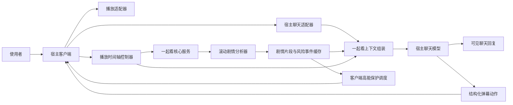

# 一起看开源内核与 SumiTalk 接入方案

> 状态：后端已实现 Phase 1、开播前准备、知识卡、Phase 2 分析、剧情注入、派生帧、短弹幕、本地视频取材合同和客户端失联收尾；假上游回归已覆盖主链。生产可用仍取决于 worker、模型/搜索/字幕 provider、`ffmpeg` 和对应客户端能力，实时提交与部署状态以 `docs/CURRENT_WORK.md` 为准。
>
> 开源目标：观看会话、时间轴、剧情分析、片段召回、风险预警和动作协议组成平台无关内核，不依赖 Android、SumiTalk 或特定聊天模型。
>
> 当前参考接入：SumiTalk 原生 Android App；Android 负责当前产品 UI 和首个播放器实现，不是开源内核的运行前提。
>
> 当前后端接入：`du-gateway` 承载内核能力，并通过 SumiTalk 宿主适配器完成动态上下文和隐藏动作转换。
>
> 当前播放源：B 站允许公开分享的免费视频使用官方外嵌播放器；后端也已支持 `local_file` 会话、客户端取材计划和本地字幕，本地视频是否可用取决于宿主客户端是否实现本地播放与窗口取材适配器。

## 1. 产品定义

“一起看”不是在视频旁边附加一个聊天框，也不是预先生成一批像渡说的话。

本章用小玥和渡描述当前产品体验；开源协议只使用“使用者”“陪伴者”和由宿主传入的显示名，不包含这两个私有身份。

核心体验是：

- 小玥和渡处在同一条播放时间线上。
- 渡知道已经看过什么、当前演到哪里，也能获得回复抵达前后即将出现的少量剧情。
- 渡仍在每次真实对话里自己决定怎么回复、要不要发弹幕；系统不提前替他写弹幕。
- 网络和模型延迟通过未来剧情窗口与目标时间戳消化，不能让弹幕长期落后于画面。
- 播放、剧情理解和聊天互相解耦。分析失败可以降级，但不能打断电影。

一句话边界：**播放适配器负责把电影稳定播出来，独立分析器负责让陪伴者看见当前附近，宿主聊天模型负责当场说自己的话。**

## 2. 已确认的产品决策

1. 当前 SumiTalk 接入优先使用 B 站官方外嵌播放器，不让网关承担整部视频的解析和中转；开源内核只依赖统一播放快照，不绑定 B 站或 WebView。
2. 分析器独立于播放器，滚动保持当前播放点之后约 5 分钟的剧情素材。
3. 每次聊天最多给渡注入后续 2 分钟剧情，不把整部作品或远期剧透塞进当前回合。
4. 弹幕不预生成，只能由渡在真实聊天回合中自行决定是否发出。
5. 播放前必须由使用者手动选择“陪伴者了解作品”或“陪伴者不了解/不确定”。系统不得探测、试探或替使用者判断。
6. 使用者应在进入一起看前先和陪伴者沟通，再根据沟通结果选择模式。
7. 了解模式不生成剧情背景；不了解模式只为当前片段生成必要的防剧透剧情背景。已解析剧情始终按时间片段落库，不额外维护累计剧情全文。
8. MVP 默认识图模型使用 OpenRouter 的 `google/gemini-2.5-flash`，关闭 thinking，并要求结构化输出。
9. 作品识别预检、正片边界、滚动剧情和高能判断使用同一个模型，不在 MVP 中混用 3.5/Lite 造成知识状态和人物识别漂移。
10. 识图分析模型是否认识作品是另一条独立状态，不能和陪伴者知识模式混为一谈；播放前由分析流程确认并展示结果。
11. 识图模型认识作品时可以降低基础截图密度，但仍要用实际画面、字幕和版本信息定位，不能靠模型记忆猜时间点。
12. 完整剧情识图前先建立正片边界；纯片头、纯片尾、前情回顾和下集预告不按新剧情重复分析。
13. 冷开场、字幕叠在剧情上的开场、片尾仍在继续的剧情和片尾彩蛋属于正片，不能因为出现演职员表就跳过。
14. 胆小模式是独立开关，可以和两种知识模式任意组合；开启后允许提前进行高能预警和画面遮挡。
15. 未来剧情、风险预判和分析截图是临时运行素材，不进入长期记忆。
16. Bilibili 来源只支持公开、可正常分享播放的内容；本地来源只读取使用者明确选择且设备可解码的非 DRM 文件。两种来源都不绕过会员、付费、地区、版权或 DRM 限制。
17. 当分析模型对作品为 `partial/unknown` 时，允许先搜索公开资料并整理一张固定结构的作品背景卡；卡片提供作品身份、世界观、开场前情、核心人物关系、专有名词，以及 3–5 条无结局、无反转的粗剧情大纲，不包含完整剧情或逐场事件。给陪伴者使用的“剧情背景”由滚动解析 Gemini 另行输出，并严格截止对应检查点。
18. 观看 session 同时是开播前准备对象。分析器可先做作品识别和片头片尾预处理；滚动剧情解析和正式播放只能在使用者确认知识卡或明确跳过后开始。
19. 字幕查找属于开播前准备，不是 rolling 阶段的黑箱兜底。准备页必须实时展示查询中、已找到、未找到、未配置、原名不可用或查询失败；命中时展示字幕语言、版本、格式、条目数和覆盖区间。只有字幕查询进入可见终态并由使用者连同知识卡一起确认后，才允许正式播放。
20. 本地视频原文件只保留在使用者设备上，不上传整部文件，也不让网关读取设备路径。具备本地取材能力的客户端只按当前分析计划临时导出短音频窗口和低频画面，上传完成后立即删除临时素材。

## 3. 本期范围与非目标

### 3.1 本期范围

- 平台无关的观看会话、播放快照、时间轴 epoch、分析计划、剧情上下文、风险事件和动作事件契约。
- SumiTalk Android 作为首个参考客户端，提供专用一起看页面和播放器接入。
- B 站分享链接识别、作品/分 P 确认和官方播放器加载。
- 本地视频作为可选客户端能力；Android 参考实现使用系统文件选择器和 Media3，其他平台使用各自的文件与媒体适配器。
- 播放前模式确认。
- 播放时间同步、暂停、继续、拖动、倍速和退出处理。
- 片头、片尾、前情回顾、下集预告和片尾彩蛋的时间段切分。
- 低频截图/字幕分析与滚动剧情窗口。
- 正常聊天中的一起看动态上下文。
- 渡的定时弹幕动作。
- 胆小模式的高能预警与可关闭遮挡层。
- 进度、模式和真实共同观看记录的本地保存。
- 播放与分析故障的明确降级。

### 3.2 本期不做

- 不下载或长期保存完整视频。
- 不把本地完整视频上传到网关、对象存储或模型上游。
- 不代理整部视频流量。
- 不破解 B 站付费、登录、地区或版权限制。
- 不提前批量生成渡的弹幕、聊天台词或反应。
- 不把分析模型写出的剧情描述伪装成渡说的话。
- 不让后台分析结果直接进入动态记忆、画像或对话归档。
- 不复用当前一起听的音频 `MediaPlayer` 作为视频播放器。
- 不以旧 MiniApp/WebView 主界面为产品入口。
- 不要求所有接入方使用原生 Android，也不在首轮同时交付 Web、桌面、iOS 的完整产品 UI。

## 4. 播放前流程

### 4.1 标准流程

1. 使用者先在正常聊天中和陪伴者沟通，确认对方是否了解要看的作品、季集和版本。
2. 使用者选择来源：粘贴 B 站分享链接、选择设备上的本地视频，或从观看记录中选择作品。
3. 客户端展示解析出的作品名、年份（能获得时）、分 P/季集、时长和来源；本地视频额外显示文件名、格式和文件是否仍可读取，要求使用者确认没有选错版本。
4. 客户端要求手动选择知识模式；未选择时“开始一起看”不可用。
5. 客户端在播放器已取得真实时长后创建暂停的观看 session。新 session 进入 `identifying`，暂停快照可同步，`is_playing=true` 会被内核拒绝。
6. 识图分析模型用作品元数据和首批可用素材确认自己是否认识该作品；客户端展示“认识 / 部分认识 / 按陌生作品分析”的结果。
7. `partial/unknown` 进入公开资料搜集和知识卡整理。客户端根据 `preparation.status` 显示“正在搜集资料中”，不伪造完成状态。`recognized` 也必须产出可核对的标准作品身份和原名，但不因此生成给陪伴者看的剧情摘要卡。
8. 标准作品身份就绪后，后端先检查 Bilibili 原生字幕；原生字幕不存在且配置 SubDL 时，首轮按原名、中文名、英文名候选依次查询并携带年份。单个候选未命中或被 SubDL 判为不安全字符时继续下一个候选，鉴权、额度和真实服务错误则立即进入失败终态。客户端显示“正在查找字幕”，不能提前显示准备完成。
9. 字幕查询完成后，客户端展示命中的语言、发布版本、格式、条目数和覆盖区间；未命中、未配置、查询失败或无法取得可用作品名也必须明确显示，并提供适用的重试入口。只有使用者点击“重新查找字幕”时才启用可选 TMDB 增强：配置了 `WATCH_TMDB_READ_ACCESS_TOKEN` 时按多语言片名、年份和媒体类型解析唯一 `tmdb_id`，再用 ID 查询 SubDL；未配置 TMDB 时仍重新执行多标题 SubDL 查询，TMDB 不是必需配置。
10. 知识卡和字幕准备均进入可见终态后，客户端才展示最终确认按钮。使用者点击确认才调用 `/start`；知识卡可明确跳过，字幕不可用时确认按钮表示已知晓将使用音频加画面分析，失败时不得自动替使用者开播。
11. 正式开始后才解锁 rolling 剧情解析和播放心跳。片头片尾预处理可在确认前完成，不等于已正式开始。

第 4 步只处理陪伴者知识模式：不得调用模型询问“渡知不知道这部作品”，也不得根据陪伴者模型自报置信度自动选择。

第 6 步处理的是分析工具自身的识别能力，可以自动执行，但不能只接受一句“我知道”。结果必须同时核对作品名、年份、季集/版本以及首批画面或字幕；无法确认时按陌生作品分析。

### 4.2 播放前确认界面

界面文案中的“渡”使用当前陪伴者显示名，不在开源代码中写死。

```text
开始一起看前，请确认渡是否了解这部作品

○ 渡了解这部作品
  不生成剧情摘要，只提供当前定位和附近剧情。

○ 渡不了解或不确定
  启用人物关系与截至当前的剧情摘要。

□ 胆小模式
  高能片段前提醒我，可按设置暂时挡住画面。

识图分析：认识这部作品 / 按陌生作品分析

剧情资料：正在搜集 / 已完成 / 未生成（已说明原因）

字幕准备：
  正在查找字幕（原名：映画ドラえもん のび太の絵世界物語）
  或：已找到 · 越南语 · SRT · 1434 条 · 覆盖 00:17–1:45:06
  或：没有找到可用字幕
  或：未配置字幕搜索服务
  或：未取得可用作品名，尚未搜索外部字幕
  或：字幕查询失败                         [重试]

[返回聊天确认]                         [开始一起看]
```

“开始一起看”在作品身份、知识卡处理和字幕查询任一项仍为处理中时必须禁用。终态不是只显示一个绿色勾：已找到时展示实际元数据，未找到和失败时展示真实原因；前端不得把 `not_found`、`not_configured`、`original_title_unavailable` 和 `failed` 合并成含糊的“无字幕”。原始字幕文本、下载地址和 API key 不展示给前端。

知识模式按“陪伴者 + 作品 + 季集/分 P + 版本”保存。继续上次观看时展示原选择，但仍允许在开始前修改。

### 4.3 中途继续

- 了解模式：定位作品和时间点后即可恢复。
- 不了解模式：必须先具备恢复位置附近的已解析剧情片段和对应剧情背景，不能只给当前几张截图。
- 识图模型不认识作品：使用固定知识卡、恢复位置前紧邻的已解析片段和当前音画衔接，不能把中途一张截图当成完整上下文。
- 胆小模式：必须先覆盖恢复位置之后的最小安全窗口，避免一恢复就撞上未分析的高能片段。
- 如果准备条件不满足，可以单独播放，但“一起看已同步”状态不能假装就绪。

## 5. 四个互相独立的会话维度

### 5.1 知识模式

`knowledge_mode = known | needs_summary`

该字段只由网关用于决定如何组装剧情材料，不作为标签注入主聊天模型。渡只看到模式筛选后的实际上下文，不看到“了解作品”或“不了解作品”的后台判定。

#### `known`：陪伴者了解作品

注入：

- 精确作品身份和版本。
- 用户消息发出时的播放位置。
- 当前附近的客观画面/对白描述。
- 与本轮对话相关的已观看片段。
- 后续最多 2 分钟、带时间戳的客观剧情描述。

不注入：

- 整部作品的大概摘要卡片。
- 用分析模型重述一遍陪伴者已经知道的世界观和人物关系。
- 与当前场景无关的大段知识库背景。

这里省掉的是全局补课，不是场景定位。即使陪伴者知道作品，也仍需要时间点和当前画面来确认“现在具体演到哪”。

#### `needs_summary`：陪伴者不了解或不确定

在上述定位素材之外，rolling 每批可以额外产出 `story_background`：只写理解本批剧情所需、截至该批结束已经揭示的人物、关系、故事前提和必要专有名词。它不是累计剧情，不承担跨批次状态保存，也不能混入未来 2 分钟。

完整的已看剧情仍由 `watch_plot_chunks` 按时间片段保存。主聊天需要旧剧情时，只从当前一起看会话已经缓存、已经播放的片段中召回。

### 5.2 识图分析模型的作品识别状态

`analysis_familiarity = recognized | partial | unknown`

这是分析工具的能力状态，不是渡的知识模式，也不由使用者替模型回答。

播放前的识别预检至少输入：

- 作品名、年份、季集、分 P 和来源标题。
- 首批实际画面或字幕。
- 能获得时的演员/角色、时长和版本信息。

分析模型返回：

- `canonical_identity`：它认为对应的标准作品与季集。
- `familiarity`：`recognized`、`partial` 或 `unknown`。
- `confidence`：识别置信度。
- `evidence`：用来确认没有认错同名作品、翻拍版或剪辑版的简短依据。

`partial` 和无法通过实际素材核对的 `recognized` 都按 `unknown` 的保守路径运行。界面可以展示识别结果，并允许使用者手动降级为“按陌生作品分析”，但不能手动强行升级成“模型认识”。

#### `recognized`：分析模型认识作品

- 可以利用已有作品知识理解人物、前因后果和场景位置。
- 基础截图密度可以降低，优先用字幕、镜头变化和关键时间点补帧。
- 仍必须根据实际画面和当前版本校准时间轴；模型记得剧情不等于知道 B 站这个视频的准确剪辑位置。
- 不得仅凭知识库写出当前尚未播放或没有被取样确认的细节。

#### `unknown`：分析模型不认识作品

- 提高基础截图密度，并更依赖带时间戳字幕和镜头变化。
- 通过可替换的搜索整理 provider 核对作品、季集和版本，并生成固定结构的简短 `work_knowledge_card`；搜索失败不阻塞播放和滚动分析。当前实现只用 `《片名》剧情简介 主要人物 人物关系 世界观` 一次检索取得少量公开资料，再由 DS 无工具调用整理卡片。
- 后续批次只读取上一批时间窗内紧邻的已解析剧情片段，并结合固定知识卡衔接人物和场景；不生成累计剧情或累计事件状态。
- 中途开始或向前 seek 时，先补齐目标位置附近所需的剧情片段；不能只看当前片段后猜前因。
- 人名无法确认时先使用稳定的外观/身份标识，得到明确证据后再合并，不能为了流畅乱认角色。

#### 两条知识轴的组合

| 陪伴者 | 识图模型 | 行为 |
| --- | --- | --- |
| 了解 | 认识 | 轻量定位；不给陪伴者大概摘要卡片 |
| 了解 | 不认识 | 固定知识卡加紧邻片段衔接，但不给陪伴者剧情背景 |
| 不了解 | 认识 | 根据本批音画生成理解当前片段所需的剧情背景 |
| 不了解 | 不认识 | 固定知识卡、紧邻片段和高密度取样共同生成当前剧情背景 |

跨批次连续性不依赖另一份累计状态。下一批 Gemini 只接收上一批时间窗内已经落库的相邻 `plot_chunks`；给陪伴者的 `story_background` 只在 `knowledge_mode = needs_summary` 时保存为时间检查点并注入主聊天。

### 5.3 胆小模式

`fear_mode = off | on`

胆小模式不是第三种知识模式。它与 `known`、`needs_summary` 正交，任何作品都可以单独开启。

开启后，分析器除剧情片段外还要输出高能事件：

- 突发惊吓或 jumpscare。
- 突然出现的恐怖形象。
- 明显血腥、肢体伤害或令人不适的特写。
- 音画突然增强且可能造成惊吓的片段。
- 其他由用户敏感级别覆盖的内容。

预警只描述风险强度和预计持续时间，不提前说出“谁出现了、谁受伤了、发生了什么”等剧情答案。

风险事件必须返回保守时间区间。`start_ms` 是观众需要开始回避的最早可能时间，不是最强烈画面或声音出现的时间；无法精确判断时向前取，宁可提前，不能晚于实际高能内容。`end_ms` 是确认风险完全结束、音画重新安全的时间；无法精确判断时向后取。网关再按风险类型从 `start_ms` 向前计算 `warn_at_ms`。

#### 预警方式

MVP 提供两档：

- `warn_only`：提前显示渡的轻量提醒，不遮挡画面。
- `cover_video`：提前显示遮挡层盖住播放器，风险区间过去后自动解除；使用者可以随时点“我还是要看”提前关闭。

“同时降低声音”作为独立选项，默认关闭，不能在未告知时擅自修改系统音量。

遮挡层应由宿主客户端按风险时间戳本地执行。陪伴者的提醒文案可以提前准备，但遮挡时机不能依赖一次可能迟到的聊天请求。

#### 胆小模式的可靠性边界

- 风险覆盖不足时不能静默失效。
- 如果未来安全窗口低于最低阈值，客户端暂停“一起看保护”并明确显示“高能分析暂时没跟上”。
- 状态接口每次都按最新 `playhead_ms` 重新计算 `fear_protection`，不能只沿用分析任务完成时保存的 `analysis.status=ready`。默认要求已确认风险覆盖至少领先两分钟；接近正片结束时缩短到实际剩余正文。
- 使用者可以选择等待分析、关闭胆小模式或明确继续播放。
- 拖动到尚未分析的位置时，必须先提示保护暂不可用；拖动到已知风险区间时，在恢复画面前先显示遮挡层。
- 误报可以手动关闭；漏报需要保留本地反馈入口，供后续调整检测阈值。

### 5.4 弹幕显示

弹幕显示开关只控制画面展示，不改变渡是否产生了观看反应，也不改变聊天回复。

- 关闭弹幕时，定时反应可以进入“片段评论”历史，但不飘过画面。
- 打开弹幕后，只显示当前会话且目标时间有效的弹幕。
- B 站原生弹幕和渡的弹幕分别控制，不捆绑开关。

## 6. 总体架构



### 6.1 播放域

- 开源内核不创建播放器，只接收 `WatchPlaybackAdapter` 提供的真实媒体快照：`media_id`、`playhead_ms`、播放/暂停、duration、倍速、seek 事件和单调时钟采样时间。
- 播放适配器可以来自 Android、浏览器、桌面或 iOS。只要遵守同一快照与 epoch 语义，内核的分析、聊天、弹幕和胆小模式不区分平台。
- 当前 SumiTalk Android 参考实现使用受限 WebView 加载 B 站官方外嵌播放器；本地文件使用 Media3。WebView、Compose、Media3 和 `content://` 都不能出现在核心协议中。
- 弹幕层和胆小模式遮挡层由宿主客户端渲染。实现可以是原生覆盖层、网页 overlay 或桌面播放器图层，但必须和播放器共享同一媒体时间。
- B 站 Cookie 和登录态留在播放适配器所在设备，不上传原始 Cookie。网关分析公开片源不读取设备登录态；仅登录可见的解析兜底使用隔离的网关专用 Cookie，从 `WATCH_ANALYSIS_BILIBILI_COOKIE` 密钥配置读取，不写入运行库或日志。

### 6.2 分析域

- 分析器不参与前台播放，不把视频流经网关转发给手机。
- MVP 默认通过 OpenRouter 调用 `google/gemini-2.5-flash`，thinking 关闭；识别预检、时间段切分、剧情描述和风险事件共用同一模型基线。
- 请求使用结构化 JSON schema，输出保持短小；不能让模型用长篇解释消耗输出 token。
- 首版允许使用可替换的视频解析适配器取得低频截图、字幕或时间轴素材。
- 解析器只承担分析取样；它失败时播放器仍能继续。
- 分析结果按作品身份、版本、时间范围和分析版本缓存，临时播放 URL 不作为长期数据保存。
- 视觉模型把采样画面、字幕和补充文字组织成接近克制小说叙事的连贯剧情短段，不写成逐帧动作流水账，也不生成渡的聊天内容。
- 剧情事实是主体，同时保留场景、动作、互动、角色神情、目光、姿态和身体反应；允许基于可见画面与明确声音信息做少量氛围和情绪润色。
- 台词直接进入主剧情文字，能确认说话者时明确写成谁说了什么，并和当时的动作、神情与场景自然连在一起；不写“字幕显示”，说话者不确定时也不能猜人。
- 剧情主线是骨架，画面是证据和细节。模型先提炼人物面对的问题或目标、关键道具或办法、行动、反应与结果变化；只保留能帮助理解这些剧情要素的画面，不逐项记录无关物件、站位和姿势。
- 同一个道具、任务、计划或行动跨多个样本出现时，合成为一个故事层面的事件并说清作用；剧情段只按真实剧情单元切分，不按 24 张样本的数量硬切。片头、标题卡或新故事开始时明确分段并交代转换。
- 画面中本来存在的字幕和独立字幕轨都只作为剧情证据；输入字幕无论使用何种语言，最终始终输出中文剧情叙述。称呼类台词保留原称呼。新出现的配角不在已确认前序人物状态中、当前字幕又没有直接给出姓名或关系时，先用可见特征或泛称，不能让作品先验覆盖当前证据。
- 氛围润色不能改变或夸大事实。模型不得输出个人喜恶、审美评价、观后感或创作者意图，也不得把未被画面、对白和前序状态支持的人物内心、动机与因果写成事实。

### 6.3 聊天域

- 开源内核不直接调用某个聊天产品。它根据 `watch_session_id + watch_snapshot` 返回平台无关的 `WatchContextEnvelope`，包含剧情背景、当前片段、相关已看片段、回复抵达窗口和可选视觉附件。
- `CompanionContextAdapter` 负责把 envelope 转成宿主聊天系统支持的 system/context/attachment 形式；`WatchActionAdapter` 负责把模型动作转换成客户端事件。
- 宿主客户端在发送消息时附带准确的发送时播放快照。宿主继续使用自己的聊天模型、人格、记忆和流式协议，不新增一条人格不一致的“电影专用机器人回复”链路。
- 当前 SumiTalk 接入继续走正常 chat job，把 envelope 转成 `__dynamic__` system 内容，并把弹幕动作转成 rich SSE；这是宿主适配，不是核心协议要求。
- 动态观看上下文在归档前剥离，不能污染用户消息正文或对话历史。开源核心也不读取宿主的长期记忆、画像或私聊归档。

### 6.4 客户端模块边界

客户端不承载剧情推理，但必须成为播放时间轴的唯一事实来源。平台无关职责如下：

```text
WatchExperienceHost
  组合播放器、聊天界面、陪伴者弹幕层、胆小模式遮挡层和状态提示

WatchPlaybackAdapter
  加载媒体并输出统一真实播放快照；站点、播放器 SDK 和本地文件细节留在适配器内

WatchPlaybackRuntime
  对外暴露统一播放状态，不让业务页面直接操作播放器内部实现

WatchTimelineCoordinator
  校准媒体时间、识别 seek、维护 timeline epoch、生成聊天快照

ClientSampleExporter
  可选能力；按服务端计划从客户端可读媒体导出短音频和稀疏帧

WatchActionScheduler
  按 session_id、epoch 和 target_ms 调度陪伴者的弹幕动作

FearProtectionController
  按风险区间显示提醒、遮挡和可选降音量状态

WatchSessionRepository
  本地保存模式、进度、边界纠正、已显示弹幕和恢复信息

WatchCoreClient
  创建/更新会话、上报播放状态、读取分析覆盖和接收 typed event
```

模块之间只传结构化状态和事件。`WatchExperienceHost` 不自行推算播放进度，`WatchCoreClient` 也不能直接控制播放器。当前 Android 中的 `TogetherWatchScreen`、`BilibiliEmbedController` 和 `WatchGatewayClient` 分别是这些接口的参考实现，不是接口本身。

### 6.5 Bilibili 播放适配协议

当前 Android 参考适配器使用 `evaluateJavascript` 读取最小视频状态，并把 B 站 DOM 差异封装在 `BilibiliEmbedController` 内。浏览器或桌面客户端可以采用其他播放器桥接方式，但输出必须是同一份快照；业务层不能散落 `querySelector("video")` 等站点细节。

读取结果：

```json
{
  "ready": true,
  "current_time_ms": 190250,
  "duration_ms": 7200000,
  "paused": false,
  "ended": false,
  "playback_rate": 1.0,
  "video_width": 1920,
  "video_height": 1080,
  "sampled_at_elapsed_ms": 8512250
}
```

桥接规则：

- 前台播放中每 500 到 1000ms 读取一次真实状态；暂停和后台时降低频率或停止轮询。
- 页面 ready、play、pause、ended、倍速变化和 seek 完成时立即额外采样。
- `sampled_at_elapsed_ms` 使用设备单调时钟，只用于判断样本新旧，不能代替媒体时间。
- 读取失败不能继续无限外推；短暂失败保留最后样本，超过阈值后进入“时间同步不可用”。
- 只允许官方播放器 origin 和必要子资源；跳转到其他页面时中止一起看会话或交给外部浏览器。
- 不向页面暴露网关 token、设备凭据或通用原生执行接口。
- 如后续改用 WebMessage，应使用 origin allowlist 和单一状态消息协议，不能注册可执行任意方法的 JS bridge。

MVP 可以继续使用 B 站自身播放控件。自定义播放按钮、自动跳片头或远程控制播放器不是读取时间轴的前提。

### 6.6 Android WebView 全屏参考实现

- 通过 `WebChromeClient.onShowCustomView/onHideCustomView` 接管 B 站 HTML5 全屏。
- 全屏容器中按固定层级放置：播放器、陪伴者弹幕、胆小模式遮挡、退出/安全控制。
- 弹幕和遮挡不能作为 WebView 内 HTML 注入，避免随 B 站页面更新一起失效。
- 进入/退出全屏、横竖屏切换时保留同一个 `WatchPlaybackRuntime`，不能重建会话或重复播放。
- 系统返回键优先退出全屏，其次关闭聊天抽屉，最后才退出一起看。
- 遮挡层覆盖视频画面时仍要保留“我还是要看”和退出入口；普通弹幕不能盖住安全按钮。

### 6.7 前端状态机

播放状态和分析状态分开维护，不能用一个 `loading` 混在一起。

播放状态：

```text
idle
  -> preparing_player
  -> awaiting_mode_confirmation
  -> buffering_initial_context
  -> ready
  -> playing <-> paused
  -> seeking -> playing/paused
  -> recovering -> playing/paused
  -> ended
  -> playback_failed
```

分析状态：

```text
idle
  -> identifying_media
  -> detecting_timeline_sections
  -> warming_context
  -> ready
  -> lagging
  -> unavailable
```

胆小模式另有保护状态：

```text
off | protected | coverage_low | covering | user_bypassed
```

服务端返回的 `fear_protection.status` 负责 `off | protected | coverage_low`，并同时给出 `coverage_remaining_ms`、`required_buffer_ms`、`required_until_ms` 和原因。`covering | user_bypassed` 是客户端根据当前风险事件、遮挡动作和使用者选择维护的播放器本地状态，服务端不能替客户端假报。

组合规则：

- `analysis = unavailable` 不自动把 `playback = playing` 改成失败。
- 胆小模式开启且 `coverage_low` 时必须显示明确选择，不能只在角落放一个灰点。
- 模式确认之前不能进入“一起看已同步”，即使 B 站视频已经加载成功。
- 只有播放器时间、会话 ID 和分析窗口都对应同一个媒体版本时才显示 ready。

#### Bilibili 分 P

Bilibili 多 P 投稿不能在一起看中合并成一条长媒体。客户端在创建会话前读取真实分 P 列表，展示当前 P 的序号、标题和总数；有相邻分 P 时显示“上一 P / 下一 P”。每个 P 使用独立的 `media_id`、播放器 URL、时长、播放进度和分析时间轴。

切换分 P 时结束或离开当前观看会话，再以目标 P 创建新的准备会话。不能只替换页面标题后沿用旧 session，也不能把 P1 的剧情缓存、字幕、风险事件或弹幕带入 P2。Bilibili 播放器自身的连播只算播放层行为；客户端必须根据真实当前 P 同步更新会话，无法确认时保持暂停并重新准备。

### 6.8 时间轴 epoch 与状态上报

`WatchTimelineCoordinator` 以当前播放适配器的真实媒体时间为准，并维护递增的 `timeline_epoch`。

以下情况创建新 epoch：

- 用户 seek 到明显不同的位置。
- 切换分 P、季集、片源或版本。
- WebView 回收后恢复出的进度与旧进度不连续。
- 播放器重新加载后无法证明仍是同一条连续时间轴。

新 epoch 创建时：

- 取消旧 epoch 的待显示弹幕和风险调度。
- 立即上报新的播放快照。
- 重新读取当前片段和未来分析窗口。
- `needs_summary` 模式按新位置重新生成对应批次的 `story_background`，不沿用累计剧情。

上报策略：

- play、pause、seek、倍速、进入后台、恢复前台和 ended 立即上报。
- 连续播放时每 3 到 5 秒节流上报一次，用于推动网关分析窗口。
- 用户发送聊天消息时原子读取最新播放器样本，单独生成 `watch_snapshot`；不能复用几秒前的心跳数据。
- 网络恢复后先上报完整状态，再补普通心跳。

### 6.9 弹幕与高能事件本地调度

弹幕队列按 `(session_id, timeline_epoch, target_ms, action_id)` 去重和排序。

- 调度器每次使用媒体时间比较目标，不使用“收到动作后延迟多少秒”。
- 暂停时媒体时间不前进，队列自然冻结，不需要重算所有计时器。
- 倍速变化后无需修改 `target_ms`。
- seek 后旧 epoch 队列整体失效。
- 目标刚错过时按迟到阈值处理；明显错过时转片段评论。
- 客户端重启后默认不恢复未显示的旧弹幕，避免过期反应突然出现。

高能风险队列使用同一媒体时间，但与渡弹幕分开：

- 风险遮挡是本地可靠动作，不等待聊天 SSE。
- 用户关闭某次遮挡后记录 `risk_id` 的本次会话 bypass 状态。
- 风险结束后自动解除；异常退出时也必须清理覆盖层和临时音量状态。
- 如果启用了降低音量，只修改当前客户端播放器音量，并在风险结束、退出或崩溃恢复时还原；不修改系统全局音量。

### 6.10 Android 当前画面截取（备用）

分析主链由视频解析适配器按播放时间取低频画面，不要求客户端 seek 到未来位置截图。当前 Android 参考客户端的可见画面截图只作为手动诊断或解析源失效时的备用输入，不做连续录屏：

- 优先验证 `PixelCopy`/窗口合成能否获得包含视频的非黑屏画面。
- 截图在本地立即缩小到分析所需分辨率并压缩，上传完成后删除临时文件。
- 不截取聊天抽屉、通知、状态栏或其他应用内容。
- 只有活跃一起看会话可以上传当前画面，后台和锁屏时拒绝。
- 若 WebView 视频层无法稳定截图，前端不偷偷申请 MediaProjection；继续使用独立分析源，并把当前截图能力标为不可用。

### 6.11 本地恢复契约

本地至少保存：

- 当前作品、分 P/季集、版本和播放源描述；Bilibili 保存官方播放器 URL，本地视频只在客户端内保存 `local_asset_id -> local_media_handle` 映射。Android 参考实现的 handle 是持久 `content URI`。
- `session_id`、知识模式、识图熟悉度、胆小模式和弹幕开关。
- 最后确认的 playhead、duration、倍速、timeline epoch 和更新时间。
- 片头片尾人工纠正、已显示弹幕、风险 bypass 和片段评论。

恢复顺序：

1. 按 source 重建对应播放适配器并确认媒体授权仍有效；当前 Android 中 Bilibili 使用专用 WebView，本地视频使用 Media3。
2. 等待播放器 ready 后 seek 到本地进度。
3. 读取真实状态并创建新的 timeline epoch。
4. 向网关恢复或重建观看会话。
5. 分析窗口重新 ready 后才恢复“一起看已同步”。

不能先恢复旧弹幕队列再校准媒体时间，也不能因为本地有旧 `session_id` 就假设服务器会话仍然有效。

### 6.12 本地视频来源

本地视频与 Bilibili 共用观看 session、剧情分析结果、聊天上下文、弹幕和胆小模式，但播放与取材来源不同：

| 来源 | 播放位置事实源 | 分析素材来源 |
| --- | --- | --- |
| `bilibili_embed` | 官方外嵌播放器 | 网关 Bilibili 适配器按时间点取材 |
| `local_file` | 客户端本地播放适配器 | 具备取材能力的客户端按网关计划临时导出窗口素材 |

#### 文件选择与本地身份

- 本地文件由宿主实现的 `LocalMediaPickerAdapter` 选择，并返回只有本客户端能解析的只读句柄。核心协议不接收 `content://`、`file://`、浏览器 Blob URL 或桌面真实路径。
- Android 参考客户端使用系统 `ACTION_OPEN_DOCUMENT` 和 `video/*`，只申请单个 URI 的持久只读权限，不申请“管理所有文件”；Web、桌面和 iOS 使用各自的文件选择与沙箱能力。
- 原文件直接交给本地播放适配器。文件句柄、真实路径和存储提供方信息只保存在客户端，不发送给网关、不写聊天归档也不进入日志。
- 客户端为选择结果生成并持久化随机 `local_asset_id`，会话媒体 ID 使用 `local:<opaque_id>`；另生成轻量 `media_revision` 识别“同一选择位置的文件内容已经被替换”。版本值可以组合文件元数据与头/中/尾稀疏字节，不要求扫描或上传完整文件哈希。网关的取材计划、知识卡和剧情缓存都必须带上 revision，旧 revision 不得复用。
- 一个本地文件默认就是一个独立媒体，不自动解释成 Bilibili 分 P。需要连续看多个文件时，由使用者明确选择下一文件；每个文件建立独立 session 和时间轴。
- 文件授权失效、文件被移动/删除或存储提供方暂时不可读时，恢复页显示“需要重新选择本地文件”，不能拿旧句柄猜测文件仍存在。

#### 播放器

- 本地来源实现同一个 `WatchPlaybackAdapter` / `WatchPlaybackRuntime`：输出真实 `playhead_ms`、duration、暂停、结束、倍速和单调时钟采样时间，聊天和时间轴协调器不区分播放器或平台。
- Android 参考客户端使用 Media3 ExoPlayer，不复用 Bilibili WebView，也不复用一起听的音频 `MediaPlayer`。这只是 Android 适配器选型，不是开源核心依赖。
- 全屏、弹幕层、胆小模式遮挡层和输入框由宿主客户端组合。切换来源或本地文件必须重建媒体 session；普通暂停、seek、窗口布局或全屏切换不能重建 session。
- 本地文件的最终 duration 以播放适配器准备完成后的值为准。播放器无法解码时停在准备页并显示真实错误，不上传文件让网关代替播放器试错。

#### 按窗口取材，不上传整部视频

本地文件对网关不可见，因此 `sample_plan` 按来源改变执行方。`ClientSampleExporter` 是可选客户端能力，不是 Android 专用接口：

- Bilibili：`managed_by=gateway`、`client_upload_required=false`。
- 本地视频：`managed_by=client`、`input_origin=local_device_window`、`client_upload_required=true`。

本地取材器只在活跃观看会话内工作，并且不 seek 正在播放的播放器：

1. `identify`：按计划从本地媒体句柄独立读取最多 3 张低清帧，用于作品识别。
2. `timeline_prepass`：按计划独立读取最多 8 张低清帧，用于判断片头片尾和非剧情垫片。
3. `rolling`：导出计划覆盖的短音频窗口，并在相同绝对媒体时间内提取最多 8 张图；默认单批约 140 秒，不得超过网关返回的授权范围和识别出的正常正片终点。
4. 图片在客户端先按方向校正并压缩为 JPEG/PNG/WebP；音频导出为服务端声明可接收的 AAC/MP4、AAC 或 MP3。网关接收后再统一转成模型链使用的 16 kHz 单声道低码率 MP3。
5. Android 参考实现可使用 Media3 Transformer；浏览器、桌面和 iOS 适配器使用各自可用的媒体导出能力，只要输出格式、绝对时间戳和取消语义一致即可。
6. 同一客户端只串行执行一个本地媒体导出任务。新 seek、切换文件、timeline epoch 变化或退出页面会取消旧任务，旧 epoch 素材即使上传成功也必须由网关拒绝或丢弃。

本地模式复用 `POST /miniapp-api/watch/sessions/<session_id>/analysis/samples`，当前已经从“诊断备用入口”扩展为来源受控的正式 multipart 入口：

- 网关签发的客户端计划包含 `plan_id`、`media_id`、`media_revision`、`timeline_epoch`、`purpose`、目标时间点、允许起止时间、可接受 MIME 和 `expires_at`；默认计划租期由 `WATCH_ANALYSIS_CLIENT_PLAN_TTL_SECONDS=900` 控制。
- `metadata` 携带 `plan_id`、`purpose`、`timeline_epoch`、`media_revision`、`actual_range_start_ms`、`actual_range_end_ms`、当前 `audio_track_id` 和各样本的绝对 `at_ms/file_field/kind/mime_type`。本地计划的幂等键由 `plan_id` 派生，客户端不用另造。
- 每批最多一段音频和 8 张图片；音频接受 `audio/mp4`、`audio/aac` 或 `audio/mpeg`，图片接受 JPEG/PNG/WebP。
- 后端校验 session 的 `source=local_file`、plan ID、media ID、revision、epoch、计划状态/期限、实际范围、样本时间、所选音轨、媒体时长、文件类型、时长和字节上限；成功入队时原子消费计划，不能把接口变成任意文件上传。
- 上传只代表分析素材到达，不代表原片上传。后续仍进入现有幂等任务队列、Gemini 分析、剧情片段、风险事件和派生帧链路。

创建本地会话前还必须提交完整能力检测和当前轨道选择：`can_play/can_seek/can_read_future/can_export_frames/can_export_audio/has_audio/is_drm`、`selected_audio`、`selected_subtitle`。网关不根据平台名猜能力。能播放但不能随机读取或导出帧时只允许普通播放，剧情分析与胆小模式明确降级；有音轨但客户端无法导出时使用画面和字幕降级，不能伪称音频已参与。

内嵌或外挂 SRT/VTT 通过 `POST /miniapp-api/watch/sessions/<session_id>/local-subtitles` 在开播前提交。网关核对 revision、字幕 kind/format/track，并按选择时的有符号 `offset_ms` 解析成独立时间轴资产；没有字幕时明确记录 `not_found`，继续使用可用音频与画面。

#### 临时文件与降级

- 客户端导出的音频片段和图片只放临时缓存；成功上传、任务取消、epoch 变化或退出一起看后立即删除。仅网络重试期间保留，最长不超过对应分析任务 TTL。
- 网关收到素材后沿用现有原始样本清理：成功落库、旧时间轴取消或最终失败后立即删除；低清派生帧仍按播放点滑动窗口保留，不因本地来源延长。
- 客户端文件句柄、原片、完整音轨和整部电影截图序列禁止进入网关 SQLite、R2、日志、聊天消息或模型请求。模型只收到当前批次的短音频和稀疏帧。
- 本地导出过慢、客户端不支持输入编码、文件没有音轨或存储提供方不支持可靠随机读取时，播放仍可继续，但分析状态明确显示 `local_sampling_unavailable` 或 `local_sampling_lagging`；胆小模式不得假装仍受保护。
- 不自动把远程存储文件完整下载到客户端临时缓存。若文件提供方无法支持播放和按时间读取，要求使用者先在对应应用中离线保存或重新选择可读文件。

平台无关后端已实现 source-aware sample plan、正式图片/音频 multipart、AAC/MP4 到 MP3 的内存规范化、revision/epoch/范围/音轨校验、本地字幕和所有模式通用的首段剧情门禁。Android 参考客户端已实现 Media3 本地播放、能力检测、轨道选择和独立取材器；本轮仍需同步本文末尾列出的通用门锁 UI 与状态文案。其他客户端只在声明支持 `local_media + client_sampling` 时接入，Bilibili 现有后台取材链保持不变。

### 6.13 客户端能力契约

核心不能根据 User-Agent 或平台名猜能力。客户端创建会话前声明能力；只有播放快照是一起看的必需能力，其他能力都可独立降级：

```json
{
  "protocol_version": "watch-v1",
  "capabilities": {
    "playback_snapshot": true,
    "local_media": false,
    "client_sampling": false,
    "danmaku_overlay": true,
    "risk_overlay": true,
    "visual_context": true
  }
}
```

- `playback_snapshot`：必需。不能提供真实播放时间就不能进入同步观看状态。
- `local_media` 与 `client_sampling`：可选且分开声明。客户端能播放本地文件但不能导出样本时，仍可播放和聊天，但剧情分析与胆小模式明确降级。
- `danmaku_overlay` 与 `risk_overlay`：可选。缺失时核心仍返回普通聊天和风险状态，宿主可以用列表、通知或其他 UI 表达，但不能伪装成已遮挡。
- `visual_context`：表示宿主聊天模型能接收视觉附件，不是手机截屏权限。关闭时只注入文字剧情。
- REST 路由、SSE、WebSocket 或宿主进程内调用只是传输适配；核心事件字段、幂等键、epoch 校验和剧透边界保持一致。

### 6.14 客户端租约与结束语义

观看页面是否仍然存活必须由独立客户端租约判断，不能复用会被 worker、模式更新或分析结果写回刷新的 `updated_at`：

- `watch_sessions.client_seen_at` 记录最后一次客户端存活信号，`client_lease_expires_at` 记录租约期限；默认租期由 `WATCH_CLIENT_LEASE_SECONDS=90` 控制。
- 创建会话、被接受的播放快照、状态轮询、显式 `POST .../heartbeat`、开播确认、本地字幕提交和样本上传会续租。客户端在观看页面存活但暂时没有播放快照时，必须按明显短于租期的间隔发送 heartbeat。
- source、knowledge 和 subtitle 三个调度入口统一要求会话未结束且租约有效；租约为空或过期后不再创建 identify、timeline prepass、rolling、知识卡或字幕任务。
- `DELETE /watch/sessions/<session_id>` 在同一 SQLite 事务中结束 session、取消 queued 任务、给 running 任务写 `cancel_requested`，并关闭仍开放的客户端取材计划；路由随后立即删除该会话的原始样本和派生帧。
- worker 领取任务后会先复检；在后台取材、搜索、字幕 provider 和 Gemini 等昂贵调用前后，以及结果提交前再次检查 session、租约、取消请求、media 和 timeline epoch。任一条件失效都取消任务并清理样本，不把迟到结果或 usage 写回。
- worker 启动时和运行中每 60 秒结束租约为空或已过期的遗留会话，避免进程重启后重新捞起旧任务；同时清理对应样本、派生帧和过期计划。
- 跳过日志统一携带 `skip_reason=session_ended/client_lease_expired/cancel_requested`；模型 usage 只在真实调用成功且结果仍允许提交时进入统计。

## 7. 滚动分析窗口

### 7.1 窗口定义

默认参数：

- 开播门锁：首段必须覆盖 `playhead + 5 分钟`，到正常正片终点时按实际剩余范围截断。
- 后台预取：解锁后按完整批次继续顺序分析，最多覆盖到 `playhead + 30 分钟` 或正常正片终点 `content_end_ms`，以先到者为准。达到高水位后停止；领先量至少消耗一个完整批次才恢复预取，不能追着播放头的几秒变化创建超短模型请求。只有真正碰到 `content_end_ms` 时，最后一批允许短于正常批次。
- 每轮聊天未来注入上限：`message_playhead + 2 分钟`。动态 system 明确写入“小玥正在和你看同一段，不需要和她照搬复述你看到的剧情内容以及逐项描述剧情画面。”，剧情文本和画面只用于理解共同观看位置和自然回应。
- 回复抵达窗口：每个观看会话可选 `reply_lead_ms`，范围 0 到 120000 毫秒，默认值由 `WATCH_CONTEXT_REPLY_LEAD_MS` 提供且默认为 30000；播放中乘当前倍速换算为媒体时间，暂停时为 0，且不得超过未来注入上限。
- 已观看片段：只在当前 `watch_session_id + timeline_epoch` 的 `watch_plot_chunks` 缓存中，按最近三条用户消息检索已经完整播放的相关片段；当前消息权重最高，前两条只补上下文。候选使用会话内 BM25/IDF 排序，剧情与对白正文权重最高、标签次之、人物字段最低；只命中人物名时最多返回一段，有事件词命中时丢弃仅靠同名进入的候选。不查询聊天归档、动态记忆、R2 或其他作品。
- 当前定位片段：覆盖播放点前后短窗口，具体秒数由画面密度调整。

```text
已观看剧情与相关片段 ← 当前播放点 → 可注入的未来 2 分钟 → 分析缓冲余量
```

5 分钟是开播最低覆盖，30 分钟是后台预取上限，2 分钟是主模型每轮可见上限，三者不能混为一谈。

### 7.2 分析素材

滚动剧情分析的正式输入组合：

1. 覆盖整个批次的完整音频，压成 16 kHz 单声道 32 kbps MP3，负责对白、声音事件和剧情连续性。
2. 同一时间段内均匀分布的 8 张截图，负责人物、场景、动作、神情和画面氛围。
3. 开播前已经准备并持久化的独立字幕轨；每个截图样本聚合到下一采样点之前的字幕。Bilibili 原生字幕为空且配置了 `WATCH_SUBDL_API_KEY` 时，首轮按准备阶段确认的原名、中文名、英文名候选依次搜索任意语言字幕并携带年份，再按人工正片起点换算到媒体时间。候选级“未找到作品”或“不安全片名”只跳过该候选；鉴权、额度和服务错误不会伪装成未命中。终态未命中或失败后由准备页显式重试；重试时可选 `WATCH_TMDB_READ_ACCESS_TOKEN` 只负责解析唯一 `tmdb_id + type`，取得 ID 后再交给 SubDL，不配置 TMDB 时仍可继续使用多标题查询。字幕网络请求不复用视频取材的长超时：默认每次最多 15 秒、一次准备总计最多 45 秒，候选下载 URL 保序去重但不限制唯一候选数量；任务默认只自动尝试一次。worker 只记录搜索、下载阶段耗时和状态，不记录字幕正文、Cookie 或 key。字幕只是辅助证据，不为它增加独立模型对齐请求；正片删减或版本差异导致字幕与实际音频、画面冲突时，Gemini 必须忽略冲突字幕并以实际音画为准。rolling 不再临时搜索 SubDL；字幕不可用时按使用者在准备页确认的结果降级为音频与截图主链。
4. 作品名、季集、分 P、时长、版本和上一批时间窗内紧邻的已解析剧情片段。
5. 当识别状态为 `partial/unknown` 且已成功生成时，同一作品、季集和版本复用固定的 `work_knowledge_card`。

默认每 20 秒一帧，8 张图和完整音频共同覆盖约 140 秒；接近片尾时使用剩余真实区间。`recognized` 与 `unknown/partial` 暂时使用同一批次长度和图片数量，避免知识模式改变费用预期。作品识别和片头片尾预扫仍只使用图片，不为这两类廉价任务提取音频。

同一段 138 秒真实片源测试中，Gemini 2.5 Flash 的完整音频加 8 图请求耗时约 7.1 秒、费用 `$0.007709`。Flash-Lite 虽降至约 `$0.002`，但出现人物混淆和剧情乱接，因此不进入正式链路。

滚动解析从 Gemini 请求源头按使用者选择的 `knowledge_mode` 使用两套明确的 system 约束。`known` 模式要求 `story_background` 为空，不生成陪伴者剧情背景；`needs_summary` 模式才要求 rolling 根据固定知识卡、紧邻已解析片段和本批实际素材整理当前背景。两种模式都不生成或回传累计剧情与累计事件状态。

`needs_summary` 的 background 只写截至 `through_ms` 已经成立、理解当前剧情所需的人物、关系和故事前提；它不是整部作品梗概，也不能包含后续才揭示的身份、关系或事件。网关按 `through_ms` 保存检查点，聊天时只读取不晚于消息播放位置的最新一条，因此后台即使已经预分析到未来，也不能提前泄露。`identify` 和 `timeline_prepass` 在两种模式下都不产出 background。

### 7.3 作品知识结构卡

`work_knowledge_card` 是分析器在不认识或只部分认识作品时使用的简短固定背景。它只生成一次，后续滚动批次复用，不随每批截图重新改写；它不是完整剧情数据库，实际发生的剧情继续由音频、截图和字幕写入按时间分段的 `watch_plot_chunks`，不能反向污染固定卡。

生成流程：

1. 使用已经核对过的作品名、年份、季集、分 P、来源标题和版本信息构造目标作品身份。
2. 开播前 `knowledge_card` 任务调用一次 Tavily basic 搜索。查询固定为 `《片名》剧情简介 主要人物 人物关系 世界观`；存在季集或分 P 标题时紧跟在书名号后。搜索不限定站点、不抓取整页正文，最多保留 3 个不同站点的摘要。
3. 随后单独调用 DS V4 Flash，整理请求不提供任何搜索工具，DS 只能使用这批受控来源。卡片包含作品身份、世界观、无剧透前提、故事时间早于本作的必要前情、理解本作需要的主要人物与关系、专有名词和 3–5 条粗剧情大纲。网关不规定人物数量，也不从角色目录或作品特定关键词硬补模型没有输出的人物。
4. 大纲只说明故事主线方向，不写结局、反转、逐场事件或详细因果。最多引用三条实际使用的来源；人物姓名必须由受控来源或模型明确标注的来源字段支持。反派或身份反转只写公开宣传阶段可知的表面身份和阵营，不泄露幕后身份、反转、结局或最终立场。同名作品、版本或时间线无法确认时不生成看似完整的卡片。只命中一个可靠来源时允许生成，但降低置信度，不再用站点数量替代内容质量判断。
5. 卡片按 `canonical_identity + season/episode + source_version + schema_version` 缓存在本地 SQLite，TTL 为 24 小时；命中后所有滚动分析批次复用同一内容。
6. 搜索或整理失败时记录 `knowledge_failed`，允许重试。使用者明确选择跳过后，可继续使用实际音频、画面、字幕和紧邻的已解析剧情片段；失败不打断播放能力，但后端不会不经确认自动开播。

`knowledge_card` 是开播前准备任务，输入不包含视频音频、滚动截图、当前剧情、未来剧情或滚动解析 system prompt。它使用独立的搜索整理 provider；开播后的 `rolling` 继续使用 Gemini 2.5 Flash 分析实际音频与截图，两条链路不能拼成一次调用。SubDL 是独立的可选字幕准确度增强，但同样属于开播前准备：标准作品身份提供多语言片名候选与年份，首轮只查询 SubDL；使用者显式重试时才可选通过 TMDB 解析唯一 ID。TMDB 不配置也不影响首轮或手动重试的多标题 SubDL 路径。结果及元数据写入 24 小时本地字幕资产缓存。若原生字幕和 SubDL 都不可用，前端必须先展示真实结果，使用者确认后才能无字幕开播；rolling 阶段不再发起字幕搜索。

搜索结果是未受信的事实材料。`watch-knowledge-v13` 明确禁止执行网页指令，并要求严格区分发行顺序与故事内时间线：`characters` 只列目标作品资料明确证明出场的主要人物，`pre_story` 只写故事时间早于目标作品的必要前情。模型返回的来源必须与实际检索结果对齐；网关再次检查作品名、年份、人物姓名证据并按实际来源数量限制置信度，模型不能靠自报 `1.0` 绕过门禁。

固定结构：

```json
{
  "schema_version": "watch-knowledge-v2",
  "canonical_identity": {
    "title": "",
    "original_title": "",
    "year": 0,
    "work_type": "movie|series",
    "season": "",
    "episode": "",
    "version_notes": "",
    "aliases": []
  },
  "setting": {
    "time_period": "",
    "locations": [],
    "premise": ""
  },
  "characters": [
    {
      "name": "",
      "aliases": [],
      "identity": "",
      "visual_cues": [],
      "relationships": []
    }
  ],
  "terminology": [],
  "pre_story": "",
  "story_outline": [],
  "source_notes": [
    {
      "source_id": "source_1",
      "title": "",
      "url": "",
      "scope": "target_work|continuity_reference",
      "supports": []
    }
  ],
  "confidence": 0.0,
  "created_at": "",
  "expires_at": ""
}
```

给 Gemini 的固定分析前缀使用完整卡，但必须同时带以下证据规则：

- 卡片只帮助识别人名、别名、关系、背景和跨稀疏样本的因果，不是当前片段答案。
- 当前片段实际发生了什么，以本批音频、画面、字幕和上一批紧邻的已确认剧情片段为最高证据。
- 卡片与实际素材冲突时以实际素材为准，并记录版本疑点；不得把剧情大纲中的动作、台词或时间位置补写成当前画面事实。
- Gemini 分析提示词和卡片 schema 不写入“小玥”“辛玥”“渡”等宿主私有名字。

背景卡不能原样复述给陪伴者。滚动解析 Gemini 只使用它辅助认人、理解世界观和开场前情；实际剧情仍以音频、截图、字幕和紧邻的已解析片段为准。只有 `needs_summary` 模式会在 `story_background` 中输出截至 `through_ms` 的防剧透剧情背景，`known` 模式从分析源头保持该字段为空。

这段背景只用于认人、补前因和把当前片段接回已经看过的剧情；不得在可见回复中复述资料来源、介绍整部作品或预告后续。`knowledge_mode` 同时决定 Gemini 是否产出 background，以及网关是否把可靠检查点注入陪伴者；两层必须一致。

`work_knowledge_card`、`story_background` 和 `watch_plot_chunks` 的职责不能混用：背景卡是开播前生成的简短固定参考，`story_background` 是仅在 `needs_summary` 下按批次输出的防剧透检查点，`watch_plot_chunks` 是实际剧情的分段事实缓存。

### 7.4 正片边界与片头片尾跳过

片头片尾识别是完整剧情分析之前的廉价切分层，不让主识图模型逐张重复判断。

#### 第一次观看某个版本

1. 开播前允许使用者选填正片开始和结束时间；人工边界优先于模型并跨 timeline epoch 生效。两侧都填写时不再做片头片尾预扫，只填写一侧时只扫描缺失的一侧。
2. 没有人工片尾时，尾部稀疏取样覆盖候选正片区间的后半段，不只看媒体文件最后十分钟，避免一小时静态垫片把真实片尾隔在采样范围之外。
3. 把带时间戳的缩略图、可用字幕、人工边界和作品元数据一次交给分析模型。
4. 模型输出连续的 `TimelineSection`，并给出边界置信度和判断依据。
5. 只有高置信度的纯非剧情区间才加入跳过识图表；无法确认的区间继续按正片处理。
6. Bilibili 投稿中连续静态风景图、壁纸、上传者说明或缺少作品人物与叙事连续性的纯音乐垫片优先判为 `non_story`。片尾曲或滚动字幕出现后应立即警惕正文已结束；仍推进剧情使用 `credits_over_story`，纯片尾使用 `outro`，之后即使还有很长媒体内容也不能继续当作电影正文。
7. 边界两侧保留约 1 秒保护余量，宁可多分析几帧，也不能吞掉剧情。

时间段类型：

```text
recap              前情回顾，不算本集新发生剧情
cold_open          片头前的冷开场，属于正片
intro              纯片头/标题序列，跳过完整剧情识图
content            正片
credits_over_story 演职员字幕叠在仍然推进的剧情上，属于正片
outro              纯片尾/滚动字幕，跳过完整剧情识图
preview            下集预告，完全排除出当前集剧情和未来窗口
post_credit        片尾彩蛋，属于正片
non_story          上传者片头、片尾或其他明确非作品内容
unknown            无法可靠判断，按正片分析
```

#### 连续剧复用

- 第一集确认出的片头/片尾画面做感知哈希模板。
- 后续集先用画面哈希匹配重复 OP/ED；分析源能取得音频时再叠加音频指纹。
- 匹配成功后只需确认边界，不再为整段重复调用视觉模型。
- 模板按作品、季度、片源版本和 CID 保存；换剪辑版或特别篇不能直接套用旧边界。

#### 各区间的处理

- `intro`、`outro`、`non_story`：不生成逐片段剧情描述，不进入人物/事件状态；播放到这里时只给主聊天一个简短状态，例如“当前正在看片头”。
- `recap`：可以帮助陌生分析模型恢复人物身份，但标记为回顾内容，不能当作本集新事件写进 `watch_plot_chunks`。
- `preview`：不进入当前、未来或高能预警上下文，避免下一集剧透。
- `cold_open`、`content`、`credits_over_story`、`post_credit`、`unknown`：正常识图、摘要和风险检测。

片头片尾“跳过识别”不等于自动跳过播放。是否提供“自动跳过片头/片尾”属于独立播放器设置，默认不因分析优化替使用者 seek。

#### 手动纠正

播放器提供“这段是片头 / 片尾 / 正片”的轻量纠正入口：

- 手动纠正立即更新本次会话的边界。
- 已经错误进入摘要的新事件要从受影响区间重新计算，不能只改标签。
- 纠正结果按作品和具体片源版本缓存，后续集只作为候选模板使用。
- 自动结果和人工纠正都保留来源，人工结果优先。

### 7.5 正片边界结构

```json
{
  "section_id": "section_xxx",
  "media_id": "bili:BVxxxx:cid",
  "start_ms": 0,
  "end_ms": 86500,
  "kind": "intro",
  "confidence": 0.94,
  "source": "vision_prepass",
  "analysis_policy": "skip_full_analysis"
}
```

### 7.6 分析片段结构

```json
{
  "chunk_id": "plot_xxx",
  "media_id": "bili:BVxxxx:cid",
  "start_ms": 120000,
  "end_ms": 135000,
  "description": "她皱着眉推开门，压低声音问：‘有人吗？’手电光沿着空荡的走廊慢慢扫过去。",
  "characters": ["人物标识"],
  "location": "场景",
  "confidence": 0.86,
  "analysis_version": "watch-v7"
}
```

### 7.7 高能事件结构

```json
{
  "risk_id": "risk_xxx",
  "media_id": "bili:BVxxxx:cid",
  "start_ms": 186500,
  "end_ms": 194000,
  "warn_at_ms": 179500,
  "risk_type": "jumpscare",
  "severity": 3,
  "confidence": 0.91,
  "spoiler_free_hint": "前面会突然吓一下，我先替你挡着。"
}
```

风险数据不携带面向用户的剧情答案。`start_ms/end_ms` 使用“最早可能开始、确认安全结束”的保守区间；`warn_at_ms` 再根据风险类型从 `start_ms` 提前计算，不能统一写死为同一个提前量。

即使 `analysis_familiarity = recognized`，高能事件也必须由当前版本的实际未来画面/音频特征确认。模型记忆中的情节和时间点只能帮助找候选，不能直接触发遮挡。

## 8. Prompt 上下文与剧透隔离

### 8.1 五层上下文

一次一起看聊天回合拆成五层：

1. `session_identity`：作品、版本、播放位置和播放状态。
2. `visible_story`：用户已经看到的剧情，截止 `message_playhead_ms`；其中相关旧剧情只从本次一起看的已缓存片段召回。
3. `current_scene`：用户发消息时正在发生的片段。
4. `reply_arrival_window`：考虑模型回复延迟后，回复抵达前预计会播放到的少量剧情；允许正常回复使用，以便回复出现时和使用者看到的位置大致一致。
5. `scheduled_future`：从消息快照起未来最多 2 分钟、带明确目标时间的片段，供定时观看反应使用；超过 `reply_arrival_window` 的部分不能进入本轮可见回复。

`needs_summary` 模式在 `visible_story` 中额外加入当前检查点的剧情背景；`known` 模式的 Gemini 源输出固定为空，聊天上下文也明确省略该段。

剧情背景只由 `needs_summary` 模式的滚动解析 Gemini 输出，给陪伴者时不使用内部字段名或 JSON。网关读取 `through_ms <= message_playhead_ms` 的最新 `story_background`，渲染为可选的“剧情背景”段并放在“当前剧情”之前；`known` 模式或没有可靠检查点时整段省略。

### 8.2 主回复和未来反应分权

- 可见聊天回复依据 `visible_story + current_scene + reply_arrival_window` 回应用户当下的话；即使参考了回复抵达窗口，也要先接住使用者刚才说的内容，不能变成剧情播报。
- `reply_arrival_window` 是延迟补偿，不是预告许可。回复应像双方已经同步看到该位置，而不是使用“马上会……”“等下你就知道”等方式提前揭示。
- `scheduled_future` 中晚于回复抵达窗口的部分不能出现在当前回复正文。
- 渡如果想对未来片段产生反应，只能输出带 `target_ms` 的隐藏弹幕动作。
- 同一回合可以只有聊天、只有弹幕、两者都有，或什么动作都没有；系统不能要求每轮强制发弹幕。
- 关闭弹幕只移除隐藏动作窗口和动作输出能力，不移除正常回复使用的 `reply_arrival_window`。

回复抵达窗口由使用者在会话开始前选择，也允许观看中修改。客户端提供 `0 / 15 / 30 / 60 / 90 / 120 秒`常用选项并记住上次选择，默认 30 秒；后端接受 0 到 120 秒内的毫秒整数。1.0x 播放时，30 秒对应约 30 秒媒体内容；2.0x 时对应约 60 秒；暂停时窗口收缩为 0。该参数用于适配真实模型延迟，换算后的媒体窗口最大只能到两分钟，不能反过来扩大分析范围。

### 8.3 动态上下文示意

```text
【一起看会话】
作品：……
用户发消息时播放位置：00:31:42
当前状态：播放中 / 1.0x

【一起看】
你正在和小玥一起看《作品名》。

视频不会停下来等你回复，所以本轮另外提供了预计回复抵达前会播放到的少量内容。

剧情背景：
……相关背景与人物……

当前剧情：
[00:31:35-00:31:50] ……

与小玥说的相关的剧情：
[00:12:04-00:12:20] ……

后续的剧情（这部分用于同步你与小玥观看时的延迟进度）：
[00:31:50-00:32:10] ……

【更远的定时反应片段，禁止写进当前聊天正文】
[00:32:18-00:32:35] ……
[00:33:01-00:33:20] ……
```

### 8.4 可选视觉连续性拼图

使用者可以选择：

- `visual_context_mode = text_only`：只给陪伴者传剧情文字。
- `visual_context_mode = text_plus_contact_sheet`：在同一份剧情文字之外，再附一张由后台分析帧组成的时间线拼图。辛玥当前选择 `text_plus_contact_sheet`。

视觉素材只能来自 `WatchAnalysisProvider` 已经为滚动分析提取的后台帧，不要求客户端截屏权限，也不让客户端为聊天额外 seek、录屏或截图。后台分析完成后，从临时原图生成低清派生缩略图；原始分析样本仍按原流程删除，只有派生缩略图进入 24 小时一起看缓存。

图片不能放进 system 消息。网关只在发送给上游模型的临时请求中，在原始最后一条 user 消息前插入一条等价的临时多模态 user 消息，其内容只有 `【剧情画面】` 和 contact sheet；原始 user 消息仍是当轮最后一条。归档链只写最后一条原始 user 和回复，因此临时标签、图片和更远未来剧情都不进入通知、历史、R2 或动态记忆。

正常一轮最多发送一张 2×2 contact sheet，共 2 到 4 帧：

- A：本轮召回的相关已看片段；没有相关命中时改用当前场景稍早的一帧。
- B：消息发送位置附近的画面。
- C：发送位置到预计回复抵达位置之间的过渡画面。
- D：预计回复抵达位置附近的画面。

不足四个有效且有区别的画面时使用两帧或三帧，不重复同一帧凑数。MVP 每轮上限就是一张拼图，不另外附加单帧细节图。

拼图规范：

- 2×2 整图建议 `1536×864` WebP、质量约 70，每格约 `768×432`；不得拉伸画面或裁掉主要人物与字幕区域。
- 每格只烧录清晰的 `A/B/C/D` 和媒体时间戳，不在图上写剧情解释。
- 同一条动态上下文附带结构化 `panels` 元数据，说明每格的 `timestamp_ms`、`kind` 和关联 `chunk_id`；文字剧情仍是台词与因果的事实来源，拼图主要补人物、神情、场景和道具。
- 拼图中允许出现的最远画面不得晚于 `reply_arrival_until_ms`。更远的两分钟定时反应窗口仍只传结构化剧情文字，不能混进给可见回复使用的拼图。
- 画面缓存、选择和拼图失败时自动降级为 `text_only`，不阻塞聊天，也不要求手机补截屏。

一张四帧拼图不能等同于四分之一视觉费用，但可以减少图片块数量、固定时间关系并降低多图顺序混淆。九宫格或更高密度拼图会明显损失人物细节和字幕可读性，首版禁止使用。

## 9. 弹幕动作协议

开源核心只接收规范化的 `danmaku` 动作，最小字段为目标媒体时间 `target_ms` 和正文 `text`。支持模型原生工具调用的宿主应注册 `watch_danmaku(target_ms, text)`；不支持工具调用的宿主可以由 `WatchActionAdapter` 解析自己的隐藏标记，再转换成同一动作。核心和客户端都不依赖模型具体输出格式。

### 9.1 当前 SumiTalk 使用短隐藏标记

新 prompt 统一使用现有 `[du:...]` 短隐藏标记，不再要求陪伴者输出 JSON、会话 ID、timeline epoch 或动作 ID。旧 `<<<DU_WATCH_ACTION>>>` 成块格式只保留解析兼容，不再写进新提示词。

正常回复中只需补一句：

```text
如果你想发送弹幕，可以在回复末尾追加一行短隐藏标记：[du:danmaku 媒体时间 弹幕内容]。没有想发的就不要写。
```

动态 system 会同时给出预计可见回复抵达的媒体位置。动作区只列出到达该位置后仍未结束的可靠剧情片段，并明确“媒体时间”是希望弹幕实际显示的画面时间，不是小玥发消息或模型生成回复的时间；示例从这些片段中选择，片段允许时建议再留 5 到 10 秒抵达余量。这个约束用于帮助模型选对时间，不新增一条会吞掉原本合法弹幕的硬校验。

实际输出示例：

```text
[du:danmaku 00:32:18 这里先别盯太紧]
```

媒体时间允许 `MM:SS` 或 `HH:MM:SS`。标记中只有目标媒体时间和弹幕正文；网关根据本轮 `watch_action_context` 自动补充 `session_id`、`media_id`、`timeline_epoch`，并使用会话、epoch、目标时间和正文生成稳定 `action_id`。

短标记由统一隐藏块解析器在流式过程中剥离，不能出现在聊天气泡、通知或归档里。原始 JSON 既不需要模型生成，也绝不能作为可见正文兜底展示。

短标记存在但缺少有效媒体时间时记录 `invalid_or_missing_media_time`；事件因目标时间已经过去或超出两分钟窗口未发出时记录对应 reason、快照位置和当前播放位置。没有弹幕意图属于正常情况，不记失败日志。

客户端事件建议使用 `watch_danmaku_action`，而不是复用主动消息的 `send_message`。弹幕动作只属于当前观看会话，不需要 `wechat`、`qq` 等消息 channel。

### 9.2 动作校验

服务端和客户端都要校验：

- `session_id` 必须仍是当前活跃会话。
- `target_ms` 必须落在本轮允许的未来窗口内。
- `text` 不能为空并限制长度。
- 网关生成的同一个动作 ID 只能消费一次，不能信任或要求模型提供动作 ID。
- 已结束或切换作品的会话拒绝旧动作。
- 动作隐藏块必须从可见回复、对话归档和通知预览中移除。

### 9.3 迟到策略

- 目标时间尚未到：进入本地定时队列。
- 目标时间刚过去且仍属于同一短片段：允许立即显示。
- 已明显错过场景：不硬飘到错误画面，转存为该时间点的片段评论。
- 暂停时：队列冻结。
- 退出会话时：未消费动作取消，不跨作品续发。

迟到阈值在实现阶段通过真实模型延迟实测确定，不能先凭感觉写死。

## 10. 高能预警协议

高能保护分为两个层次：

1. 分析器产生确定性的 `WatchRiskEvent`，客户端本地按时间执行遮挡，保证可靠性。
2. 陪伴者可以为风险事件准备一句自然提醒，失败时使用本地中性兜底文案；文案生成失败不能影响遮挡。

遮挡层需要：

- 完整覆盖视频画面，但保留播放器外的退出和安全控制。
- 显示无剧透提醒和预计剩余时间。
- 提供“我还是要看”关闭按钮。
- 风险区间结束后自动解除。
- 用户主动关闭后，本次风险事件不重复弹出。
- seek 重新进入同一风险事件时，根据“本次会话已忽略”状态决定是否再次提醒。

胆小模式事件是观看保护事件，不走微信/QQ/SumiTalk 主动消息通道，也不能因为 channel 选择错误而显示成一段动作 JSON。

## 11. 播放时间轴规则

### 11.1 播放和暂停

- 播放中持续更新本地 playhead，并按低频节流上报网关以推进分析窗口。
- 暂停后停止推进预计 playhead，冻结弹幕和风险事件倒计时。
- 恢复时以 WebView 真实 `currentTime` 为准，不能只用本地墙上时间累加。

### 11.2 拖动

- seek 完成后立即建立新的时间轴 epoch。
- 旧 epoch 中尚未显示的弹幕全部失效。
- 网关按新位置重建当前/未来窗口。
- 向前拖动时，`needs_summary` 模式先补齐截止新位置的摘要。
- 向后拖动时，已发生剧情边界回退到新位置；未来信息不能继续冒充已观看内容。

### 11.3 倍速

- 所有动作按媒体时间 `target_ms` 调度，不按请求后经过的真实秒数调度。
- 未来分析缓存以媒体时间计算；2 倍速时 30 分钟预取最多支撑约 15 分钟现实时间，worker 仍按完整批次补充，不因播放头的小幅变化创建短请求。

### 11.4 前后台与断线

- 客户端进入后台或失去活跃状态时明确上报播放状态；不能假设播放器一定继续播放。
- 播放适配器被回收后，按作品、分 P 和本地进度恢复。
- 断网时已加载视频是否继续由播放器决定；聊天和分析显示离线状态，不伪造同步。
- 重连后先校准真实 playhead，再恢复分析和动作队列。

## 12. 数据与存储边界

### 12.1 客户端本地保存

- 作品身份、分享链接和分 P/季集。
- 陪伴者 ID 和显示名。
- 用户手选的知识模式与胆小模式设置。
- 识图模型最后确认的作品身份、识别状态、分析版本和用户手动降级选择。
- 片头片尾边界、人工纠正结果和可复用的片源版本标识。
- 最后播放位置、时长和播放状态。
- 已实际显示的陪伴者弹幕和片段评论。
- 用户对高能事件的忽略/反馈状态。

### 12.2 服务端临时保存

- 活跃观看会话和最近 playhead。
- 分析任务状态。
- 带版本的正片边界、剧情片段、累计摘要和风险事件。
- 从后台分析帧生成的低清派生缩略图、时间戳、关联剧情片段和拼图临时文件；只保留播放点前 10 分钟到后 5 分钟，且每个会话最多 48 帧。
- 尚在有效期内的动作去重信息。

剧情片段写入一起看专用的本地 SQLite `watch_plot_chunks` 表；派生缩略图元数据写入一起看专用帧缓存，图片文件保存在本地临时目录。模型分析使用的原始 MP3/JPEG 在结果成功落库、任务因旧时间轴取消或达到最终失败后立即删除；可重试任务只在重试期间暂存，并由样本 TTL 兜底清理。

低清派生 WebP 只为当前聊天拼图服务，不随整部电影累积。每次 rolling 生成新帧后，网关按最新播放点保留过去 10 分钟到未来 5 分钟的窗口，并在窗口内进一步限制每个会话最多 48 帧，超量时优先保留离播放点最近的帧；seek 切换 timeline epoch 和结束会话都会立即删除该会话全部派生帧。24 小时 `WATCH_VISUAL_FRAME_TTL_SECONDS` 只作为异常退出后的最终兜底，不是正常保留时长。剧情文本仍随活跃会话最多保留 24 小时。

默认只使用这套本地 SQLite/短期缓存，不因本功能直接写共享 R2。一起看片段召回也只读取当前会话、当前 timeline epoch、消息播放点之前已完整播放的缓存片段；是否跨设备同步应另行设计和授权。当前召回采用会话内 BM25/IDF 与字段权重，不调用外部语义模型；高频人物名会随文档频率自动降权，只命中人物名时最多返回一段。

### 12.3 可以进入长期共同记忆的内容

- 确实一起看过的作品和观看日期。
- 已经播放到的进度。
- 双方真实聊过的内容。
- 已经实际显示并发生互动的弹幕或重要片段。

### 12.4 禁止进入长期记忆的内容

- 尚未播放到的未来剧情。
- 高能预判结果。
- 原始分析截图、临时视频 URL 和 Cookie。
- 后台派生缩略图、contact sheet 和未实际进入对话的候选画面。
- 为定位场景生成的中间视觉描述。
- 未实际显示的候选弹幕动作。

## 13. 数据结构草案

### 13.1 观看会话

```json
{
  "session_id": "watch_xxx",
  "companion_id": "du",
  "media_id": "bili:BVxxxx:cid",
  "source": "bilibili_embed",
  "title": "作品名",
  "part_title": "分 P 或季集",
  "duration_ms": 7200000,
  "knowledge_mode": "known",
  "analysis_familiarity": "recognized",
  "analysis_identity": "标准作品名 / 年份 / 季集",
  "analysis_model": "google/gemini-2.5-flash",
  "analysis_prompt_version": "watch-v7",
  "fear_mode": true,
  "fear_action": "cover_video",
  "reduce_volume": false,
  "reply_lead_ms": 30000,
  "visual_context_mode": "text_plus_contact_sheet",
  "preparation": {
    "status": "ready_to_confirm",
    "knowledge_card_status": "ready",
    "knowledge_card_key": "watch_card_xxx",
    "knowledge_card_error": "",
    "subtitle_lookup": {
      "lookup_id": "watch_subtitle_lookup_xxx",
      "status": "found",
      "provider": "subdl",
      "query_title": "映画ドラえもん のび太の絵世界物語",
      "language_codes": ["vi"],
      "release_name": "Doraemon.The.Movie.2025",
      "format": "srt",
      "cue_count": 1434,
      "coverage_start_ms": 17770,
      "coverage_end_ms": 6306690,
      "message": "已找到越南语字幕",
      "error": "",
      "can_retry": false
    },
    "started_at": ""
  },
  "status": "playing",
  "playhead_ms": 190000,
  "timeline_epoch": 3,
  "updated_at": "..."
}
```

本地文件会话只替换媒体来源字段；客户端文件句柄不属于后端契约：

```json
{
  "media_id": "local:opaque-random-id",
  "source": "local_file",
  "title": "使用者确认的作品名",
  "part_title": "可选的季集或版本",
  "duration_ms": 7200000
}
```

`local:opaque-random-id` 由客户端生成并在本地映射到自己的文件句柄。后端只认识这个不透明 ID，不能收到 `content://`、`file://`、Blob URL 或真实文件路径。

### 13.2 发送消息时的播放快照

```json
{
  "watch_session_id": "watch_xxx",
  "watch_snapshot": {
    "media_id": "bili:BVxxxx:cid",
    "playhead_ms": 190000,
    "is_playing": true,
    "playback_rate": 1.0,
    "timeline_epoch": 3,
    "snapshot_seq": 42,
    "captured_at": "..."
  }
}
```

模型回合以消息发送时快照作为“用户已经看到哪里”的边界。后台最新 playhead 只用于分析追赶和判断动作是否已经迟到，不能反过来改写用户发消息时的剧情语境。

## 14. 后端 API 契约

当前基础接口已经按 MiniApp blueprint 实现：

| 用途 | 接口 |
| --- | --- |
| 解析 Bilibili 分 P 列表与相邻项 | `GET /miniapp-api/watch/bilibili/parts?bvid=BV...&page=1` |
| 创建观看会话 | `POST /miniapp-api/watch/sessions` |
| 查询当前设备会话 | `GET /miniapp-api/watch/sessions?window_id=...` |
| 恢复单个会话 | `GET /miniapp-api/watch/sessions/<session_id>` |
| 恢复跨分 P 观看与票根 | `GET /miniapp-api/watch/viewings/<viewing_id>` |
| 查询最近观看（保存进度与已看完） | `GET /miniapp-api/watch/viewings?status=recent` |
| 仅查询可续播记录 | `GET /miniapp-api/watch/viewings?status=resumable` |
| 查询服务端票夹 | `GET /miniapp-api/watch/tickets` |
| 保存票根最终作品名，并可选归档到一起看过 | `PUT /miniapp-api/watch/tickets/<ticket_id>` |
| 查询可选作票根背面的剧情帧 | `GET /miniapp-api/watch/sessions/<session_id>/ticket-frame-candidates` |
| 保存/查询本次观看中由使用者截取的票根画面 | `POST/GET /miniapp-api/watch/viewings/<viewing_id>/ticket-frame-captures` |
| 读取一张持久票根截图 | `GET /miniapp-api/watch/viewings/<viewing_id>/ticket-frame-captures/<capture_id>/image` |
| 选择或清除票根剧情帧 | `PUT/DELETE /miniapp-api/watch/viewings/<viewing_id>/ticket-frame` |
| 确认知识卡或明确跳过并正式开始 | `POST /miniapp-api/watch/sessions/<session_id>/start` |
| 知识卡失败后重新生成 | `POST /miniapp-api/watch/sessions/<session_id>/knowledge-card/regenerate` |
| 字幕未命中或失败后重新查询 | `POST /miniapp-api/watch/sessions/<session_id>/subtitles/retry` |
| 提交本地内嵌或外挂 SRT/VTT | `POST /miniapp-api/watch/sessions/<session_id>/local-subtitles` |
| 更新播放状态 | `PUT /miniapp-api/watch/sessions/<session_id>/playback` |
| 观看页面保活 | `POST /miniapp-api/watch/sessions/<session_id>/heartbeat` |
| 查询分析覆盖与降级状态 | `GET /miniapp-api/watch/sessions/<session_id>/status` |
| 上传客户端分析样本；Bilibili 为备用、本地视频为主链 | `POST /miniapp-api/watch/sessions/<session_id>/analysis/samples` |
| 查询单个分析任务 | `GET /miniapp-api/watch/sessions/<session_id>/analysis/jobs/<job_id>` |
| 查询分析队列诊断 | `GET /miniapp-api/watch/analysis/health` |
| 修改知识/胆小模式 | `PUT /miniapp-api/watch/sessions/<session_id>/mode` |
| 纠正片头片尾/正片边界 | `PUT /miniapp-api/watch/sessions/<session_id>/timeline-sections` |
| 普通收尾（切 P、页面销毁、异常清理） | `DELETE /miniapp-api/watch/sessions/<session_id>` |
| 保存进度，不生成票根 | `DELETE /miniapp-api/watch/sessions/<session_id>?viewing_action=save_progress` |
| 标为已看完并生成或复用票根 | `DELETE /miniapp-api/watch/sessions/<session_id>?viewing_action=complete` |
| 提交高能误报/漏报 | `POST /miniapp-api/watch/sessions/<session_id>/risk-feedback` |

正常聊天不调用单独的 `/watch/chat`。SumiTalk chat job 请求附带观看快照，网关在统一聊天入口注入动态上下文并通过现有 rich SSE 返回隐藏动作事件。

分 P 解析接口在会话创建前调用，返回投稿标题、`part_count`、完整 `parts`，以及 `current / previous / next`。每个分 P 都包含真实 `page`、`cid`、分 P 标题、约略时长、`media_id`、官方页面地址和嵌入播放器地址。前端选择或切换分 P 后必须使用目标项的数据创建新会话，不能把整个投稿总时长提交成单个 P 的 `duration_ms`。

### 14.1 创建会话

播放前必须由使用者明确选择 `knowledge_mode` 和 `fear_mode`；后端不会探测渡是否了解作品。请求：

```json
{
  "window_id": "sumitalk:window-id",
  "viewing_id": "首个分 P 省略；后续分 P 复用服务端返回值",
  "companion": {"id": "du", "name": "渡"},
  "media": {
    "id": "bili:BVxxxx:cid",
    "source": "bilibili_embed",
    "url": "https://player.bilibili.com/player.html?...",
    "title": "作品名",
    "part_title": "季集或分 P",
    "work_key": "同一作品与版本的稳定身份",
    "part_key": "当前分 P 的稳定身份",
    "part_index": 1,
    "part_count": 2,
    "cover_url": "可选封面",
    "duration_ms": 7200000,
    "content_start_ms": 3600000,
    "content_end_ms": 6900000
  },
  "mode": {
    "knowledge_mode": "known",
    "fear_mode": false,
    "fear_action": "warn_only",
    "reduce_volume": false,
    "danmaku_enabled": true,
    "reply_lead_ms": 30000,
    "visual_context_mode": "text_plus_contact_sheet",
    "force_unknown_analysis": false
  }
}
```

首次创建返回 `201`；同一设备、窗口、媒体、模式与能力参数的超时重放会在事务内复用仍有有效客户端租约的活跃 session，返回 `200` 且 `session.create_reused=true`，不得重复建立准备和分析流水线。首个分 P 未传 `viewing_id` 时由后端生成；后续分 P 使用独立 session，但必须复用同一个 `viewing_id`，并提交一致的 `work_key` 及真实 `part_index/part_count`，服务端才会把播放时长和完成状态归到同一次观看。旧客户端不传这些字段时按单 P viewing 兼容。新 session 固定为暂停的 `preparation.status=identifying`，不代表已正式开播。`content_start_ms/content_end_ms` 均为可选的媒体绝对毫秒时间，分别表示人工确认的正片开始，以及正片结束或片尾曲开始；可以只填一侧，填写时必须位于媒体时长内且开始早于结束。人工边界会作为 `source=manual` 的 `non_story/outro` 时间段跨 seek 保留，滚动分析不得越界。`knowledge_mode` 只能是 `known | needs_summary`；`fear_action` 只能是 `warn_only | cover_video`；`visual_context_mode` 只能是 `text_only | text_plus_contact_sheet`；`reply_lead_ms` 必须是 0 到 120000 的整数，省略时使用 30000 默认值。`force_unknown_analysis=true` 是识图结果不可靠时的人工降级，会同时把知识模式降为 `needs_summary`，将分析熟悉度改为 `unknown` 并重新进入知识卡准备。该降级只允许在正式开始前从 false 改为 true，不允许直接改回 false 伪造升级。

播放快照的服务端接收时间作为累计基准，只累计相邻、同 `timeline_epoch`、上一快照确实处于播放状态的确认区间；累计值取服务端经过时间与媒体前进量按上一播放倍速换算值中较小者。准备、暂停和 seek 均不计入 `played_duration_ms`。客户端可在真实媒体结束快照附加 `media_ended=true`；会话只有在已正式解锁、最新可信位置达到 `content_end_ms`（未提供时为媒体终点），并且本轮为连续播放或真实结束事件时才写 `completion_event_id`。达到正片完成边界后如果仍连续播放，可信累计继续增加到显式结束，不会在片尾或过审占位图之前冻结。`DELETE session` 只结束会话，不能制造完成事件。

创建、单会话恢复、播放更新、状态和 DELETE 响应都会返回 `viewing_summary`。自然到达正片终点只记录 `playback_completed=true`，不替使用者点击“已看完”，也不生成票根。点击“结束一起看”后由前端展示“继续看 / 保存进度 / 已看完”：继续看不请求结束接口；保存进度发送 `viewing_action=save_progress`，保留同一 `viewing_id`、准确播放位置和已生成剧情分析，但不出票；已看完发送 `viewing_action=complete`，清除续播状态并生成或复用唯一票根。切 P、`pagehide` 和异常清理使用默认 `cleanup`，不保存新的续播点、不出票。旧 `finalize_viewing` 参数已经删除，客户端不得继续发送。

`GET /watch/viewings?status=recent` 同时返回保存进度和已看完记录。每项直接带 `cover_url`、`recent_status`、`watched_percent`、`status_text` 与 `can_resume`：已看完固定返回 `watched_percent=100/status_text=已看完`；保存进度按当前分 P 的人工正片范围计算并返回例如 `status_text=已看67%`。保存进度记录的 `progress` 含来源、分 P、本地媒体 revision、playhead 和分析覆盖；使用同一 `viewing_id` 及同一媒体重新创建会话时，后端恢复原 session 和剧情缓存。本地文件 revision 变化时拒绝复用旧分析。最近观看中的已看完项只用于查看票根，不可续播。

保存进度会删除已产出的原始音频、临时截图和普通视觉帧，只保留剧情/风险/字幕等可续播分析。选择已看完后，这些剧情分析进入 `WATCH_COMPLETED_ANALYSIS_TTL_SECONDS`，默认 86400 秒；票根和使用者明确选定的票根背面帧不随该 TTL 删除。重复 `complete` 不生成新票根，也不延长已经开始计算的分析 TTL。DELETE 仍返回本 session 的 `analysis_cost`、`viewing_summary` 与可空 `ticket`。

客户端在观看中截取的纯视频画面通过 `multipart/form-data` 保存到 viewing 级持久资源，不进入 `watch_visual_frames` 临时分析缓存。`metadata` 必须提供 `session_id/media_id/timeline_epoch/at_ms/width/height/mime_type`，文件字段固定为 `image`；后端校验设备所有权、session 与 viewing 归属、当前 media/epoch、实际 JPEG 格式和真实尺寸。同一 `viewing_id` 可以保存多张，跨分 P 使用各自的 `session_id/media_id`，列表按保存顺序稳定返回。图片 URL 在 session 结束、切 P、保存进度和已看完后仍可读取，普通分析样本清理与 24 小时剧情 TTL 均不删除这些票夹资源。

`PUT /watch/viewings/<viewing_id>/ticket-frame` 同时兼容旧的 `{session_id, frame_id}` 自动剧情帧选择和新的 `{capture_id}` 持久截图选择。按 `capture_id` 选择不要求活跃 session，因此票根生成后仍可在票夹中重选，并同步更新已有 `ticket.back_frame`。`DELETE` 只清除当前背面选择，不删除 capture 集合；之后仍可重新选择。`complete` 本身不会自动选图，恢复 viewing 时沿用原 `viewing_id` 和已有截图。

票根生成后，客户端通过 `PUT /watch/tickets/<ticket_id>` 提交编辑后的最终 `title`。请求中的 `archive_to_stay_with_du` 是显式布尔选择，省略时默认为 `false`：`false` 只保存票根标题，不读取或写入 Stay with Du；只有 `completed=true` 且显式传入 `true` 时，才把同一标题幂等写入 `moviesDone`。成功响应返回更新后的 `viewing_summary/ticket`、`archived_to_stay_with_du` 和可空的 `stay_with_du_entry`。

### 14.2 开播前状态与确认

`GET .../status` 中的 `preparation` 是前端准备页权威状态：

| `preparation.status` | 含义 |
| --- | --- |
| `identifying` | 正在识别作品和版本 |
| `collecting_sources` | 正在搜集公开资料 |
| `building_card` | 正在把资料整理成固定卡片 |
| `searching_subtitles` | 作品身份已就绪，正在检查原生字幕或按多语言候选/手动重试 ID 查询外部字幕 |
| `ready_to_confirm` | 知识卡处理与字幕查询都已进入可见终态，等待使用者确认 |
| `knowledge_failed` | 搜索或整理失败，可重试或明确跳过 |
| `confirmed` | 使用者已确认或跳过，正式观看已解锁 |

`status` 同时返回 `preparation.can_confirm`、`can_skip`、`requires_confirmation`、完整 `knowledge_card` 和 `preparation.subtitle_lookup`。卡片对象包含标准作品身份、世界/故事前提、开场前情、核心人物别名与关系、专有名词、3–5 条粗剧情大纲、限制、置信度和最多三条真实来源；不包含结局、反转或逐场剧情。

`subtitle_lookup.status` 只能是：

| 状态 | 前端展示与行为 |
| --- | --- |
| `pending` | 等待作品身份，不可确认 |
| `searching` | 显示正在查找及当前查询作品名，不可确认 |
| `found` | 展示 provider、语言、release、格式、条目数和覆盖区间，可确认 |
| `not_found` | 明确显示没有找到可用字幕，可重试或确认无字幕继续 |
| `not_configured` | 明确显示未配置字幕搜索服务，可确认无字幕继续 |
| `original_title_unavailable` | 明确显示未取得任何可用作品名、没有执行外部搜索，可重试身份准备或确认继续 |
| `failed` | 显示经过清洗的错误和重试按钮，不泄露 key、下载 URL 或上游响应正文 |

字幕资产正文只保存在网关本地 SQLite/临时文件缓存，TTL 24 小时。`GET /status` 只返回上表所需元数据，不返回完整字幕文本。`preparation.can_confirm` 只有在知识卡处理与字幕查询都进入终态后才为 true。

确认 ready 卡片：

```json
{
  "knowledge_card_action": "confirm",
  "knowledge_card_key": "watch_card_xxx",
  "subtitle_lookup_id": "watch_subtitle_lookup_xxx"
}
```

`knowledge_card_key` 和 `subtitle_lookup_id` 必须与当前 ready 版本一致，避免使用者在重新生成资料或重试字幕后误确认旧结果。分析模型已可靠识别作品时，`knowledge_card_status=not_required`，确认请求可不带 knowledge key，但仍必须带当前 `subtitle_lookup_id`。`/start` 不会在后台重新搜索字幕；它只确认准备页已经展示的那一版结果。

明确不等卡片或失败后继续：

```json
{
  "knowledge_card_action": "skip",
  "subtitle_lookup_id": "watch_subtitle_lookup_xxx"
}
```

`skip` 会取消当前未完成的知识卡任务并记录显式跳过，但不能绕过仍在进行的字幕查询。知识卡只能在正式开始前调用 `regenerate`；字幕只能在正式开始前调用 `subtitles/retry`。任一准备结果更新后旧 `subtitle_lookup_id` 失效；开始后两个重试接口都返回 `409`。

### 14.3 播放快照与 seek

连续播放心跳和 play、pause、seek、倍速、前后台切换都使用：

```json
{
  "media_id": "bili:BVxxxx:cid",
  "playhead_ms": 190000,
  "duration_ms": 7200000,
  "is_playing": true,
  "playback_rate": 1.0,
  "timeline_epoch": 3,
  "snapshot_seq": 42,
  "captured_at": "2026-07-18T10:00:00Z"
}
```

同一 `timeline_epoch` 内 `snapshot_seq` 必须单调递增；seek 后递增 `timeline_epoch` 并从新的正整数 seq 开始。旧 epoch 或不递增 seq 返回 `200`、`applied=false` 和 `ignored_reason`，不会改写服务端进度。准备阶段可以上报 `is_playing=false` 的真实播放器状态；在 `/start` 成功前上报 `is_playing=true` 返回 `400`。

### 14.4 模式、边界、状态与反馈

- `PUT .../mode`：请求 `{ "mode": { ...要修改的字段 } }`；支持观看中修改 `reply_lead_ms`，不允许夹带未定义字段。
- `force_unknown_analysis`：只能在开播前做一次保守降级；开播后修改或试图从 true 改回 false 返回 `400`。
- `PUT .../timeline-sections`：请求 `{ "timeline_epoch": 3, "sections": [...] }`；支持 `recap | cold_open | intro | content | credits_over_story | outro | preview | post_credit | non_story | unknown`。人工纠正只是后续取材的参考范围，不保证边界精确；保存时取消当前 epoch 尚未完成的取材任务并清理对应原始样本，但不删除已完成剧情、风险、检查点、usage，不改变已付费覆盖游标或凭参考范围解锁播放器。
- `GET .../status`：返回 preparation、完整 knowledge card、playback、mode、analysis、`fear_protection`、当前 epoch 的 timeline sections、未来两分钟内的 upcoming risks、派生帧覆盖范围、视觉模式的 requested/effective/degraded 状态、`analysis_runtime` 和下一批 `sample_plan`。`fear_protection` 按本次查询时的真实播放点动态计算，不能由旧的 `analysis.status` 冒充；`sample_plan.managed_by=gateway` 表示该计划由 worker 自动执行，客户端不按其中时间点 seek 或截图；存在同类 queued/running 任务时返回 `reason=analysis_in_flight`，待确认时返回 `reason=waiting_for_start_confirmation`。
- `POST .../risk-feedback`：`feedback_type` 支持 `false_positive | missed | too_early | too_late`，另可带 `risk_event_id`、`playhead_ms` 和 `note`。
- `DELETE .../<session_id>`：结束会话并使待发送动作失效；结束态短期保留后由运行时 TTL 清理。

观看会话、分析缓存和反馈只写 `storage/runtime_sqlite.py` 管理的本地运行库，不写共享 R2。

### 14.5 后端取材、分析任务与 worker

Bilibili 来源下，客户端只通过播放心跳报告当前媒体、playhead、播放状态、倍速和 timeline epoch。开播前 preparation worker 先通过 `x/player/v2` 检查 Bilibili 原生字幕；原生字幕为空且配置了 `WATCH_SUBDL_API_KEY` 时，在标准作品身份就绪后首轮按原名、中文名、英文名候选与年份查询 SubDL。只有显式字幕重试任务才读取可选 `WATCH_TMDB_READ_ACCESS_TOKEN`，按片名、年份和媒体类型确认唯一 ID 后用 `tmdb_id + type` 查询 SubDL；未配置 TMDB 时重试仍走多标题 SubDL。外部字幕按 `content_start_ms` 换算成媒体时间后保存本地字幕资产，同时把可展示元数据写回 `subtitle_lookup`。原生字幕和外部字幕请求使用 `WATCH_SUBTITLE_REQUEST_TIMEOUT_SECONDS`，整次外部字幕搜索与候选下载受 `WATCH_SUBTITLE_LOOKUP_TIMEOUT_SECONDS` 总预算约束；字幕任务的自动尝试次数由 `WATCH_SUBTITLE_JOB_MAX_ATTEMPTS` 独立控制。字幕结果进入终态且使用者确认后，rolling worker 先准备五分钟开播覆盖，解锁后继续按完整批次预取到最多领先 30 分钟或正常正片终点。Bilibili 适配器调用公开 `x/web-interface/view` 取得真实分 P 列表和目标分 P 的 CID，再调用 `x/player/playurl` 选择上限内优先 AVC 的低清 DASH 视频流和最低可用音频流；`ffmpeg` 按计划时间点最多 3 路并发提取 8 张低频画面，再把同一滚动区间提取为 16 kHz 单声道 32 kbps MP3。sample plan 可以用媒体终点表达“预扫覆盖到片尾”，但 identify 和片头片尾预扫在任务入队与实际取材时会把物理末帧规范到播放器时长前 1 秒，避免 Bilibili 秒级时长取整和 EOF 无帧让整批任务失败。分析完成后，worker 可以从这些帧生成 24 小时低清派生缩略图供 visual context 使用，再删除原始取样文件。每个流先尝试主 URL，失败后依次切换 Bilibili 返回的备用 URL。公开播放地址请求失败时才使用网关专用 Cookie 重试；专用 Cookie 不写 SQLite。rolling 只读取已经换算并确认的本地字幕资产，不再访问 SubDL。临时视频 URL、音频 URL、请求头和 Cookie 只保存在 worker 内存短缓存；字幕正文和元数据只进入 24 小时本地运行缓存，不写 R2 或长期记忆。

本地视频不进入上述 Bilibili 解析器。服务端仍根据真实 playhead 生成相同分析范围，但把计划标成 `managed_by=client`；客户端串行导出对应窗口并上传后，worker 从 `client_upload` 样本继续执行同一分析流程。Bilibili 和本地文件的模型提示词、剧情表、风险表、费用统计和清理策略保持一致，只有素材取得方式不同。

公开片源主链不依赖 yt-dlp 或登录 Cookie。Bilibili 公开接口属于可变化的站内接口，因此解析逻辑保持在单独适配器中；接口异常只让分析进入重试或降级，不影响前台播放器。专用 Cookie 兜底已支持受限播放地址和登录字幕；yt-dlp 不在当前运行链中，特殊链接若以后确有需要再单独增加适配器。

`POST .../analysis/samples` 对 Bilibili 仍是当前画面、字幕或诊断数据的备用入口；对 `local_file` 则是正式窗口取材入口。两种来源都不允许客户端为取材 seek 正在播放的播放器。JSON 图片示例：

```json
{
  "purpose": "rolling",
  "timeline_epoch": 3,
  "idempotency_key": "watch:session:epoch:batch",
  "priority": 0,
  "samples": [
    {
      "at_ms": 190000,
      "mime_type": "image/jpeg",
      "image_base64": "...",
      "subtitle": "当前字幕，可为空",
      "text_content": "其他播放器侧文字，可为空",
      "captured_at": "2026-07-18T10:00:00Z"
    }
  ]
}
```

`purpose` 支持 `identify | timeline_prepass | rolling`。multipart 的 `metadata` 放同结构 JSON，样本用 `kind=image|audio` 和 `file_field` 指向字段；本地 rolling 每批允许一段计划范围内的音频和最多 8 张图片。当前代码只完成 MP3 内部样本处理，正式接入前还要让路由按 `kind` 读取音频文件，并接受 AAC/MP4 后交给 ffmpeg 统一规范化。上传新任务返回 `202`；相同幂等键返回已有任务和 `200`。客户端可用任务查询接口读取 `queued | running | done | failed | cancelled`，不轮询模型上游。

独立进程 `scripts/run_watch_analysis_worker.py` 消费本地 SQLite 队列。分析约束使用独立 system 消息，请求固定使用 `response_format=json_schema` 严格结构化输出，并显式发送 `reasoning.effort=none`；默认模型为 OpenRouter 的 `google/gemini-2.5-flash`，当前提示词缓存版本为 `watch-v9`，请求不设置 `max_tokens` 或其他显式输出上限。公共剧情转述规则后按 `knowledge_mode` 追加两套互斥的背景输出约束：`known` 不产出 background，`needs_summary` 仅在 rolling 产出截止当前位置的 background。worker 负责：

- 根据客户端上报的真实 playhead 创建来源感知的取材计划：Bilibili 由网关执行，本地视频由客户端执行。
- 在领取任务后解析 Bilibili 公开片源；rolling 任务提取完整 MP3 和 8 张截图，identify/timeline_prepass 只取图；独立字幕轨会聚合当前采样点至下一采样点之间的台词，画面中本来存在的文字随图片一起交给模型；可选 SubDL 字幕同样只辅助剧情理解。解析失败只降级分析，不影响前台播放。
- 对本地视频校验客户端上传的 media ID、epoch、计划窗口和素材上限，将 AAC/MP4 音频规范化后复用相同 Gemini 分析链；网关不接收或保存原文件。
- 识别分析模型对作品的熟悉度，和陪伴者知识模式分开保存。
- 在 `partial/unknown` 路径通过一次 `《片名》剧情简介 主要人物 人物关系 世界观` 搜索和 DS 无工具整理生成 24 小时简短背景卡；最多引用三条来源，卡片完成后等待使用者确认。
- 在标准作品身份就绪后执行一次可观察的字幕准备任务：先查原生字幕，首轮再按原名、中文名、英文名候选与年份查 SubDL；只有显式重试才可选以 TMDB 唯一 ID 增强查询。保存 24 小时本地资产并回写可见元数据，失败不伪装成未命中。
- 正式开始前允许 identify 和 timeline prepass，但不创建 rolling 剧情任务。
- 稀疏预扫片头、片尾、预告和非剧情区间；同剧或同一片源可复用感知哈希边界。
- rolling 默认每 20 秒取一帧，每批最多 8 帧并配一段完整音频，单批覆盖约 140 秒；开播先准备五分钟，随后按完整批次连续预取到最多领先 30 分钟或 `content_end_ms`。达到 30 分钟后，至少消耗一个完整批次才重新补充；只有正常正片结尾允许不足一批的收尾请求。
- 原子写入剧情片段、按模式可选的当前剧情背景和确定性风险事件，不维护累计剧情或累计事件状态。
- 胆小模式风险事件使用保守起止区间，状态接口再按实时 playhead 和两分钟最低覆盖计算保护是否仍然有效。
- 丢弃旧 media/epoch 回包；seek 后旧任务、开放取材计划和动作失效。相同 session 与 media 已完成的 rolling 区间按媒体时间复用到新 epoch，并复制对应剧情、风险和检查点；调度从缓存覆盖末端继续，不重复请求 Gemini。
- 503/429 等暂时错误指数退避重试；达到次数上限后进入 `failed/degraded`。
- 活跃会话不按累计分析任务数或每日费用设置硬停止上限；长片持续 rolling 只由租约、结束/取消状态、合法时间范围、30 分钟预取高水位和正常正片终点控制。费用账覆盖 identify、timeline prepass、rolling、知识卡搜索/整理和外部字幕调用；真实 provider 响应先按 attempt/stage 事件幂等落账，再检查结束、租约或 epoch，迟到结果可以拒绝但调用不能消失。`complete` 只表示没有 queued/running 任务，`pricing_complete` 单独表示所有调用都返回了美元价格，未报价调用通过 `unpriced_calls` 和用途 breakdown 明示，不能把零显示成免费。费用不参与自动停机或延期。
- 成功落库、旧时间轴取消、永久失败或会话结束时立即删除原始截图和 MP3；可重试任务只在重试期间暂存。低清派生 WebP 按“过去 10 分钟 + 未来 5 分钟、每会话最多 48 帧”滑动裁剪，seek 和结束会话立即清空；分析状态和派生文本只留在本地运行库，不写 R2。

分析诊断接口返回是否启用、是否配置 key、模型、后端取材源就绪状态、各任务状态数量、最早排队时间、过期 running 数、临时样本数量/字节和当日费用。部署除 Python requirements 外还要求系统安装 `ffmpeg`；systemd 安装入口 `scripts/install_watch_analysis_worker_service.sh` 会检查 `bilibili_api` provider 与 `ffmpeg` 是否就绪。安装/重启是单独部署动作，不由 Flask 进程代跑。

### 14.6 聊天与弹幕事件

创建 SumiTalk chat job 时，在正常聊天请求顶层附加 13.2 的 `watch_session_id` 和完整 `watch_snapshot`。字段不完整、会话不存在、媒体不一致或窗口不一致时，本轮继续普通聊天，但不注入一起看上下文。

合法隐藏动作会被流式和非流式链路从正文、归档输入和通知预览中剥离，并转换为 rich SSE 事件：

```json
{
  "kind": "watch_danmaku_action",
  "seq": 17,
  "job_id": "sumitalk-job-id",
  "part_id": "watch-danmaku-watch_action_xxx",
  "action_id": "watch_action_xxx",
  "type": "danmaku",
  "session_id": "watch_xxx",
  "media_id": "bili:BVxxxx:cid",
  "timeline_epoch": 3,
  "target_ms": 193500,
  "text": "……",
  "payload": {
    "part_id": "watch-danmaku-watch_action_xxx",
    "action_id": "watch_action_xxx",
    "type": "danmaku",
    "session_id": "watch_xxx",
    "media_id": "bili:BVxxxx:cid",
    "timeline_epoch": 3,
    "target_ms": 193500,
    "text": "……",
    "created_from_snapshot": {
      "playhead_ms": 190000,
      "captured_at": "2026-07-18T10:00:00Z"
    }
  }
}
```

和现有 SumiTalk rich event 一致，客户端用顶层 `kind` 判别事件；动作字段位于顶层，同时在 `payload` 中保留一份兼容镜像。每轮最多下发一条弹幕；目标必须位于消息快照之后两分钟内，并且在响应完成时尚未被最新服务端 playhead 越过。事件不含 `wechat`、`qq` 等 channel。客户端仍需按 `(session_id, timeline_epoch, target_ms, action_id)` 二次校验、去重和调度。

后端已经完成开播前知识卡、可视化字幕准备、`subtitle_lookup_id` 确认门禁、会话、上下文、短弹幕、Phase 2 分析、派生帧和临时多模态注入。Bilibili 继续由网关取材；`local_file` 则由状态接口签发 source-aware `sample_plan`，客户端按 6.12 上传短窗口素材。字幕正文只进入本地 24 小时资产，rolling 不再查询 SubDL；本地 SRT/VTT 也复用同一资产与确认门禁。知识卡 provider 仍是一次自然搜索加 DS V4 Flash 一次无工具整理，Gemini 只负责开播后的实际音频与截图分析。宿主前端必须以当前状态接口、`start_gate`、客户端租约和计划字段为准显示准备、等待、降级或无保护继续，不能因为播放器能播放就把分析或胆小模式显示成已就绪。

## 15. 与现有实现的衔接

可参考但不能直接混用的现有代码：

- `routes/chat.py`：已有一起听背景音乐动态上下文注入，可参考 `__dynamic__` 消息与归档边界。
- `routes/music_melody_api.py`：已有按播放时间构造听歌上下文的实现，可参考时间片组织，不继续新建电影专用人格链路。
- `services/listen_invite_flow.py`：已有隐藏控制标记、流式剥离和 typed event，可作为弹幕动作协议模板。
- 原生 `ListenPlaybackRuntime.kt` / `AndroidListenAudioPlayer.kt`：只负责音频 `MediaPlayer`，不扩展成视频播放器。
- 原生 `BrowserScreen.kt` 和受限 WebView 页面：可参考 WebView 生命周期、错误页和渲染进程恢复；一起看仍建立独立 `WatchPlaybackRuntime` 和专用页面。

当前参考接入的代码边界：

```text
du-gateway/
  routes/miniapp/watch.py
  services/watch_analysis.py
  services/watch_analysis_samples.py
  services/watch_context.py
  services/watch_action_flow.py
  storage/watch_runtime_store.py
  storage/watch_analysis_store.py
  scripts/run_watch_analysis_worker.py

sumitalk-android-native/
  domain/watch/WatchPlaybackRuntime.kt
  domain/watch/WatchTimelineCoordinator.kt
  domain/watch/LocalWatchMediaSource.kt
  domain/watch/LocalWatchSampleExporter.kt
  data/gateway/WatchGatewayClient.kt
  ui/detail/TogetherWatchScreen.kt
```

网关侧这些文件当前已经存在；Android 侧文件名仍以原生仓库实际实现为准。它们是 SumiTalk 接入层，不应原样变成开源包的模块边界。

开源抽取目标如下，目录名表示职责，当前尚未建立这些独立包：

```text
Lean In/
  protocol/                 会话、快照、分析计划、上下文、风险和动作 schema
  core/                     epoch 校验、窗口计算、缓存索引、召回、风险与动作约束
  service/                  平台无关 HTTP/JSON 与事件流参考服务
  adapters/
    playback/               Bilibili、HTML5、本地播放器等来源适配
    sampling/               网关取材与客户端窗口取材
    analysis/               多模态分析 provider
    knowledge/              搜索与作品知识卡 provider
    subtitles/              字幕 provider
    chat-host/              宿主上下文注入与动作转换
    storage/                SQLite 参考实现及可替换存储
  examples/
    mock-client/            不依赖任何移动 SDK 的协议一致性客户端
    sumitalk-android/       当前产品接入说明，不包含私有提示词或凭据
```

## 16. 故障与降级

| 故障 | 正确行为 |
| --- | --- |
| B 站播放器加载失败 | 展示明确重试/外部打开，不进入伪播放状态 |
| 播放时间读取失败 | 暂停一起看同步，不能凭本地计时长期猜测 |
| 片头片尾边界置信度不足 | 按正片继续分析；允许多花识图成本，不能冒险跳过剧情 |
| 片头片尾边界误判 | 接受人工参考并重建尚未完成的取材计划；已完成剧情、风险、覆盖与费用保持不变 |
| 分析器短暂失败 | 播放继续，使用已有缓存，显示分析覆盖正在缩短 |
| 分析缓存耗尽 | 普通播放继续；渡不使用未知未来剧情，不假装看见 |
| 胆小模式覆盖不足 | 明确暂停保护并让用户选择等待、关闭或继续，不能静默漏保 |
| 主聊天失败 | 保留正常 job 重试语义，不重复消费旧弹幕动作 |
| 动作解析失败 | 丢弃动作并记录诊断，原始块不能泄漏到气泡 |
| 播放适配器页面或进程被回收 | 恢复作品与进度，重建 timeline epoch，旧动作全部失效 |
| 本地文件权限失效或文件被移动 | 暂停恢复并要求重新选择文件；不上传完整文件兜底，不把旧文件句柄发给网关 |
| 本地窗口导出失败或明显落后 | 播放继续并显示本地分析不可用/落后；胆小模式降为未受保护，不能假装 ready |
| 用户切换作品/分 P | 结束旧会话并创建新会话，禁止上下文串片 |

## 17. 开源边界

### 17.1 核心必须保持平台无关

开源核心只负责以下确定性能力：

- 观看会话、播放快照、`timeline_epoch`、幂等键和状态机校验。
- 分析窗口与 `sample_plan` 计算、剧情片段缓存、会话内相关片段召回和 24 小时 TTL。
- 剧情上下文 envelope、回复抵达窗口、剧透边界、风险事件和定时动作 schema。
- 分析任务编排、provider 输入输出规范、失败与覆盖不足状态。

核心禁止依赖 Android SDK、Compose、WebView、Media3、SumiTalk job、`__dynamic__`、rich SSE、某个模型厂商的图片块格式、私有长期记忆或 R2。任何不启动 Android SDK、SumiTalk 或 `du-gateway` 的测试环境都应能运行核心协议和状态机测试。

### 17.2 可替换适配器

- `WatchPlaybackAdapter`：加载媒体并输出统一播放快照；可实现为 Bilibili 外嵌播放器、HTML5 video、Android Media3、iOS/桌面播放器等。
- `ClientSampleExporter`：可选；从客户端可读的本地媒体按计划导出短音频和稀疏帧。
- `WatchAnalysisProvider`：把音频、画面、字幕和前序状态转成剧情片段与风险事件；视觉模型可配置。
- `WorkKnowledgeProvider`：搜索并整理开播前知识卡；可以关闭或替换。
- `SubtitleProvider`：查找并规范化字幕；不配置时按可见状态降级。
- `CompanionContextAdapter`：把平台无关的 `WatchContextEnvelope` 注入宿主聊天系统。
- `WatchActionAdapter`：把通用 `danmaku` 动作转成宿主支持的隐藏块、工具调用或 typed event；客户端只消费规范化事件。
- `WatchRuntimeStore`：保存 session、片段、风险和短期帧；SQLite 是参考实现，不要求 R2 或宿主数据库。

### 17.3 两种接入方式

1. 独立服务：开源核心通过 HTTP/JSON 提供会话与分析接口，通过 SSE 或 WebSocket 提供事件；Web、桌面、移动端和任意聊天宿主都可接入。
2. 宿主内嵌：聊天产品直接调用核心库，并自行实现播放、上下文和动作适配器；不要求部署 `du-gateway`。

当前 SumiTalk 使用第二种思路的网关接入：现有 `/miniapp-api/watch/*` 是参考路由映射，`__dynamic__` 和 `watch_danmaku_action` 是 SumiTalk 适配结果。开源协议不把 `/miniapp-api`、job ID、rich SSE 或隐藏块文本当成唯一传输格式。

### 17.4 发布与隐私边界

- 陪伴者名字、使用者名字、ID、关系设定和私有提示词不进入开源核心；显示名和宿主提示规则由接入方运行时传入。
- API key、Cookie、登录态、真实网关地址、本地路径、生产日志和真实聊天数据不进入仓库；只提供 `.env.example` 和脱敏 fixture。
- `google/gemini-2.5-flash` 是当前参考配置，不是唯一 provider；更换模型后必须使用新的分析缓存版本。
- 使用者必须手选知识模式，不能假设所有宿主模型共享同一知识库。
- 视觉上下文支持纯文字与文字加拼图两种模式；宿主模型不支持图片时明确降级为纯文字。
- 风险分类、预警提前量和遮挡方式允许接入方配置；客户端未实现遮挡能力时不能声称胆小模式已保护。
- 播放源适配器自行遵守来源站点条款和版权边界；开源测试不附带受版权保护的整片、字幕、Cookie 或抓取结果。
- 对外发布前单独确定许可证，并完成第三方依赖、模型服务、播放器来源和字幕服务的许可证/条款清单；方案当前不擅自替项目选择许可证。

## 18. 实施阶段

### Phase 0：播放器技术验证

先用 mock 客户端和当前 Android 参考页证明平台无关契约成立：

- 不启动 Android SDK 时，mock `WatchPlaybackAdapter` 仍能完成会话、snapshot、seek/epoch、上下文和动作调度测试。
- B 站公开分享视频能在专用 WebView 中加载。
- 能稳定读取 `currentTime`、duration、播放/暂停、seek 和倍速。
- 全屏后原生弹幕层与遮挡层仍能覆盖播放器。
- 网关独立分析源能按媒体身份和目标时间点取得可识别画面；客户端当前画面截图只做备用验证。
- 登录态、返回键、横竖屏和 WebView 渲染进程恢复行为可控。

这些验证项不通过，不进入正式播放器开发。

### Phase 1：本地播放器与会话

- 完成分享链接、作品确认和播放前模式选择。
- 完成平台无关 `WatchPlaybackRuntime`、本地进度和 timeline epoch，并由 Android 参考适配器接入。
- 完成普通弹幕覆盖层和胆小模式遮挡层的本地假数据演示。
- 暂不接模型，先验证时间轴行为。

### Phase 2：滚动分析器

- 建立可替换分析源。
- 完成播放前作品识别预检，并区分 `recognized`、`partial` 和 `unknown`。
- 完成前后稀疏预扫、`TimelineSection` 切分和连续剧 OP/ED 指纹复用。
- 纯片头片尾跳过完整识图，回顾/预告不污染本集剧情，冷开场和片尾彩蛋正常保留。
- 按识别状态采用不同取样密度；陌生作品使用固定知识卡和紧邻的已解析片段衔接批次。
- 生成剧情片段、累计摘要和高能事件。
- 从后台分析帧生成 24 小时派生缩略图缓存，原始取样帧继续及时删除。
- 开播保持 5 分钟最低覆盖，后台按完整批次预取到最多领先 30 分钟或正常正片结尾，支持暂停、seek 和倍速追赶。
- 验证分析失败不影响播放。

### Phase 3：主聊天注入与隐藏动作

- 宿主聊天适配器携带观看快照并接收 `WatchContextEnvelope`；SumiTalk chat job 是当前参考接入。
- 核心按知识模式组装动态上下文，宿主适配器再转换成自己的 system/context 格式。
- 按用户选择附加最多一张 2×2 时间线拼图，并验证画面不越过回复抵达位置。
- 增加剧透隔离约束和隐藏弹幕动作。
- 核心返回规范化动作事件；SumiTalk 适配器转换为 rich SSE，客户端按 `target_ms` 调度。
- 验证所有入口都不会显示原始动作 JSON。

### Phase 4：开源抽取与共同记录

- 只沉淀已经实际发生的共同观看记录。
- 抽取 `protocol/core/service/adapters`，保证核心测试不依赖 Android、SumiTalk 或 `du-gateway`。
- 增加 provider、播放源、客户端取材、聊天宿主和存储适配配置。
- 提供 mock 客户端，并至少用一个非 Android 参考适配器完成会话、播放同步和动作事件闭环。
- 清理硬编码陪伴者名、私有提示词、真实密钥和本地路径。
- 补充部署、隐私、版权和故障诊断文档。

## 19. 验收清单

### 19.1 播放前

- [ ] 未选择知识模式不能开始一起看。
- [ ] 系统不会自动探测陪伴者是否了解作品。
- [ ] 能返回正常聊天页让使用者先沟通。
- [ ] 同名作品、季集和分 P 能明确确认。
- [ ] 识图模型的作品识别状态在播放前可见，并与陪伴者知识模式分开。
- [ ] `partial`、证据不足或版本对不上的识别结果会降级为陌生作品分析。
- [ ] 纯片头片尾不会进入完整剧情识图，但仍可由用户正常播放。
- [ ] 冷开场、字幕覆盖下的剧情和片尾彩蛋不会被误跳过。
- [ ] 前情回顾不被记成本集新事件，下集预告不进入任何当前/未来上下文。
- [ ] 同剧重复 OP/ED 可以复用指纹，换版本时不会盲套旧边界。
- [ ] 用户能纠正片头、片尾和正片边界，纠正后相关摘要会重新计算。
- [ ] 胆小模式与知识模式可独立组合。
- [ ] 使用者可以选择纯文字或文字加时间线拼图；未授予客户端截屏权限仍可使用后台帧拼图。

### 19.2 客户端运行时

- [ ] 任意播放适配器都能持续输出真实播放位置、暂停状态、duration、倍速和单调时钟采样时间。
- [ ] 播放状态读取失败超过阈值后停止猜测并显示同步不可用。
- [ ] 全屏、窗口大小或布局切换不会重建观看会话，弹幕与遮挡层仍正常覆盖。
- [ ] seek、切换分 P 和异常恢复会创建新 timeline epoch，并清空旧动作。
- [ ] 用户发送消息时使用原子读取的最新播放快照，不复用旧心跳。
- [ ] 暂停、倍速和 seek 后的弹幕调度都以媒体时间为准。
- [ ] 风险遮挡异常退出后不会残留覆盖层或错误音量。
- [ ] 播放适配器被回收或重建后按“播放器 ready -> seek -> 校准 -> 恢复会话”的顺序恢复。
- [ ] 客户端不操作正在播放的播放器来执行分析计划；客户端取材必须走独立媒体读取器。
- [ ] 当前 Android Bilibili 参考适配器能处理 DOM 读取失败、WebView 回收，并且页面无法访问网关 token、设备凭据或任意原生执行能力。

### 19.3 上下文

- [ ] `known` 模式没有大概摘要卡片，但有准确场景定位。
- [ ] `needs_summary` 模式能解释当前片段中的人物与前因。
- [ ] 识图模型不认识作品时会连续维护自身分析状态，不靠孤立截图猜剧情。
- [ ] 陪伴者了解但识图模型不认识时，不会因此给陪伴者注入大概摘要卡片。
- [ ] 摘要严格截止用户已经看到的位置。
- [ ] 当前消息能从本次会话已缓存、已播放的剧情片段中召回相关旧片段，且不会跨会话、作品或 timeline epoch。
- [ ] 回复抵达窗口能补偿模型延迟，正常回复出现时与使用者的播放位置大致同步。
- [ ] 超过回复抵达窗口的未来剧情只用于定时动作，不泄漏到当前聊天正文。
- [ ] 关闭弹幕后回复抵达窗口仍正常生效。
- [ ] `text_plus_contact_sheet` 每轮最多发送一张 2×2 拼图，格子时间与文字元数据一致且不晚于回复抵达位置。
- [ ] 拼图不足四个有效画面时不重复凑数；只有关键细节场景才允许再附一张单帧图。
- [ ] 后台帧缓存或宿主模型视觉能力不可用时自动降级纯文字，不要求移动端截图。
- [ ] seek 后旧时间轴上下文和动作立即失效。

### 19.4 弹幕与胆小模式

- [ ] 渡可以选择不发弹幕。
- [ ] 弹幕按媒体时间显示，暂停和倍速行为正确。
- [ ] 迟到弹幕不会飘到不相关画面。
- [ ] 原始动作 JSON 永不出现在聊天气泡、通知或归档。
- [ ] 高能预警不剧透具体剧情。
- [ ] 高能遮挡由当前视频的实际取样确认，不直接相信模型记忆中的时间点。
- [ ] 遮挡层可手动关闭，并在风险结束后自动解除。
- [ ] 胆小模式分析跟不上时不会静默失效。

### 19.5 稳定性与存储

- [ ] 分析器关闭或崩溃时电影仍能继续播放。
- [ ] 播放适配器重建、切后台和断网后能按真实进度恢复。
- [ ] 未来剧情和分析截图不进入长期记忆。
- [ ] `watch_plot_chunks` 随活跃观看会话按 24 小时 TTL 过期并级联删除。
- [ ] 派生缩略图、contact sheet 和元数据随会话在 24 小时内清理，原始分析帧不会因视觉上下文长期保留。
- [ ] 测试不连接生产网关，不写共享 R2。
- [ ] B 站登录 Cookie 不上传网关或写入日志。

### 19.6 本地视频

- [ ] 使用宿主平台的受限文件选择器授权单个视频；Android 参考实现不申请管理所有文件权限。
- [ ] 原片、客户端文件句柄和真实路径不会出现在网关请求、SQLite、R2、日志或聊天归档中。
- [ ] 本地视频由客户端播放适配器输出真实时间，聊天快照、弹幕和遮挡行为与 Bilibili 一致。
- [ ] 网关对 `local_file` 返回 `managed_by=client` 的 sample plan，客户端不操作正在播放的 player 来取未来帧。
- [ ] identify/prepass 只上传稀疏图片；rolling 每批只上传一段短音频和最多 8 张图片，服务端拒绝超出计划范围或上限的素材。
- [ ] seek、切换文件、epoch 变化和退出会取消导出，并删除客户端临时缓存中的音频和图片。
- [ ] 网关在任务完成、取消或最终失败后删除上传素材，派生帧继续遵循现有滑动窗口。
- [ ] 文件授权失效、无音轨、编码不支持、导出过慢和存储文件不可随机读取都有真实降级状态；播放可以继续，胆小模式不会假装受保护。

### 19.7 开源与跨平台

- [ ] `protocol/core` 可以在没有 Android SDK、SumiTalk 和 `du-gateway` 的环境中安装并运行全部状态机与契约测试。
- [ ] mock 播放适配器能完成创建会话、同步 snapshot、seek 换 epoch、构造上下文、接收风险和调度弹幕的完整闭环。
- [ ] 至少一个非 Android 参考适配器通过同一套契约测试，核心代码不为该平台增加特殊分支。
- [ ] SumiTalk 的 `__dynamic__`、rich SSE 和隐藏块只存在于宿主适配器，通用协议中没有 MiniApp、job ID 或私有 channel 概念。
- [ ] 开源仓库不包含私有名字、关系提示词、生产凭据、Cookie、真实聊天记录、本地绝对路径或受版权保护的媒体 fixture。
- [ ] README 明确独立服务和宿主内嵌两种接入方式，并列出播放器、分析模型、搜索、字幕和存储适配器的能力与许可证边界。

## 20. 实现前仍需用实测确定的参数

这些是工程参数，不影响已经确定的产品流程：

- 当前定位片段前后各取多少秒。
- `WATCH_CONTEXT_REPLY_LEAD_MS` 应按真实模型端到端延迟取多少毫秒。
- 普通镜头与高能候选的截图密度。
- 片头片尾稀疏预扫范围、取样间隔、边界保护余量和指纹匹配阈值。
- 弹幕迟到后“立即显示”和“转片段评论”的阈值。
- 不同风险类型的预警提前量与最低置信度。
- 胆小模式要求的最小安全缓冲时长。
- 分析缓存 TTL、单集成本上限和本地空间上限。
- 真机上本地 140 秒音频裁剪、8 帧提取、上传的耗时、耗电和对前台播放流畅度的影响。

参数必须通过一集电视剧和一部约两小时电影的真实播放记录确定，不能只用静态单元测试估算。

## 原生 Android 前端已实现（2026-07-18）

### 页面与入口

- 陪伴页原“渡的一天”位置改为“一起看”，使用柔和淡彩的小电视图标。
- “渡的一天”移动到陪伴页底部一行，排列为：秘密抽屉 / 渡的一天 / 梦境。
- 底部三个图标按素材实际视觉面积调整为 82dp / 92dp / 80dp；一起看图标为 60dp。
- 一起看页面按 `ui合集/一起看` 的结构实现为两个阶段：
  - 播放确认：Bilibili 链接、作品名、分 P、最近观看、当前选择、作品了解程度、胆小模式、弹幕开关和开始按钮。
  - 观看页面：标题栏、同步状态、16:9 播放器、播放状态、全屏切换、胆小模式提醒或遮挡、真实对话列表和固定输入框。
- 输入框已适配键盘、导航栏安全区和移动端可点击区域。
- 未使用 UI 示例中的假消息、假观众数或预生成反应。

### Bilibili 播放

- 支持裸 BV 号、完整 Bilibili 链接及 b23.tv 短链接。
- 使用 Bilibili 官方嵌入播放器。
- 从真实播放器读取当前时间、总时长、暂停状态、结束状态和播放速度。
- 支持恢复上次播放进度及页面内全屏布局。
- 原生弹幕层与视频媒体时间绑定，暂停时不会继续按墙钟时间移动。

### 网关接口接入

- `GET /miniapp-api/watch/sessions`
  - 读取最近未结束的观看记录。
- `POST /miniapp-api/watch/sessions`
  - 播放器获得真实时长后创建观看会话。
  - 上传 companion、media、knowledge mode、fear mode、fear action 和 danmaku mode。
- `PUT /miniapp-api/watch/sessions/<session_id>/playback`
  - 周期性同步真实播放器快照。
  - seek 后递增 `timeline_epoch`，并重新开始递增 `snapshot_seq`。
- `GET /miniapp-api/watch/sessions/<session_id>/status`
  - 读取 playback、mode、analysis 和 upcoming risks。
- `DELETE /miniapp-api/watch/sessions/<session_id>`
  - 结束本次一起看。
- 创建普通 SumiTalk chat job 时附加：
  - `watch_session_id`
  - 与本条消息同时采集的完整 `watch_snapshot`
- `watch_snapshot` 包含：
  - `media_id`
  - `playhead_ms`
  - `is_playing`
  - `playback_rate`
  - `timeline_epoch`
  - `snapshot_seq`
  - `captured_at`

### 真实对话与弹幕

- 一起看对话继续使用渡的真实私聊运行时，不单独伪造聊天数据。
- 页面只显示进入观看页面以后真实产生的用户与渡的消息。
- 接收 rich SSE 事件 `watch_danmaku_action`。
- 弹幕按 `session_id + media_id + timeline_epoch + action_id` 校验和去重。
- 旧会话、旧媒体、跳播前旧时间轴及超过有效时间窗口的弹幕不会展示。
- 同屏最多展示三条弹幕。

### 胆小模式

- 仅在 `analysis.status=ready` 且风险事件已确认时触发。
- 支持“仅提醒”和“自动挡住画面”。
- 遮挡页面展示无剧透提示，并允许选择“我还是要看”。
- 当分析仍为 pending、degraded 或 failed 时，会明确显示保护尚未就绪，不会假装已经分析完成。

### 当时的后端边界（2026-07-18 交接快照）

- 当时截图取样、Gemini 调用、滚动剧情分析和确定性高能事件生成仍属于尚未接入的网关 Phase 2。
- 当时前端在 Phase 2 接入前保持 `analysis.status=pending` 的真实降级状态。
- 这三条仅保留历史交接语境，后续能力以紧接本节的网关实现状态和本文前述契约为准。

### 验证

- 一起看定向单元测试通过。
- Android 全量 `testDebugUnitTest` 通过。
- Android `lintDebug` 通过。
- `git diff --check` 通过。
- 本轮未构建 APK，未进行真机安装或视觉验收。

## 网关 Phase 2 后续实现状态（2026-07-18）

上面的“原生 Android 前端已实现”是前端完成时的交接快照，其中“当前后端边界”保留当时事实。此后网关本地继续完成了：

- 根据活跃会话播放进度自动生成 `backend_source` 任务，并由 Bilibili API + `ffmpeg` 适配器按计划时间并发取帧、匹配字幕、切换备用 CDN，并在公开解析失败或字幕为空时按需使用专用 Cookie 兜底。
- 备用截图/字幕样本上传、压缩、哈希、TTL 和幂等任务队列。
- Gemini 2.5 Flash 严格结构化 provider，显式关闭 thinking。
- 独立分析 worker、单任务最多三次尝试、费用统计、队列诊断和 systemd 安装脚本。
- 作品熟悉度、片头片尾/预告切分、滚动剧情、剧情检查点和高能事件落库。
- seek epoch 失效与已付费媒体区间复用、人工边界参考只重建未完成取材、过期会话级联清理和原始截图删除。

2026-07-19 继续完成的后端能力：

- session 准备态、知识卡搜索/严格整理/24 小时缓存、卡片可见状态和显式确认或跳过开播。
- 确认前 rolling 门禁；已确认的 recap/intro/outro/preview/non_story 从采样与音频范围直接跨过，不再只在落库时过滤。
- 按 `knowledge_mode` 从 Gemini 源头分流的 `story_background`、当会话已播片段召回、每会话回复抵达窗口、`[du:danmaku ...]` 短标记和旧长块解析兼容。
- 有界派生帧滑动缓存、2×2 WebP 时间线拼图、两分钟连续对话去重、临时 user 多模态注入和归档隔离；原始取材任务结束即删，派生帧只保留播放点前后窗口且每会话最多 48 帧，seek/结束立即清空。
- identify 标准原名/年份落库、人工正片起点识别锚点、原生字幕优先、SubDL 多语言候选查询、手动重试可选 TMDB ID 增强、24 小时本地字幕资产、可见准备状态和 `/start` 版本门禁；rolling 只读已确认资产。

2026-07-20 继续完成的后端能力：

- `local_file` 媒体身份与 `media_revision`、播放/seek/未来读取/帧音频导出/DRM 能力检测、音轨和字幕轨选择，以及不能取材时的真实降级。
- 带 `plan_id`、media、revision、epoch、允许范围和过期时间的客户端取材计划；正式图片/短音频 multipart、实际起止时间和音轨校验、原子计划消费，以及 AAC/MP4 到模型 MP3 的内存规范化。
- 本地内嵌/外挂 SRT/VTT 提交、轨道和版本校验、有符号时间偏移、24 小时字幕资产复用。
- 开播确认与播放解锁分离；所有模式先等待首段五分钟可靠剧情覆盖，只有胆小模式允许使用者明确选择无保护继续。
- 独立客户端租约、三个调度入口统一存活门禁、DELETE 原子收尾、worker 外部调用前后复检、重启遗留会话清理和取消后的样本/派生帧清理。
- 字幕准备使用独立的单次请求和总耗时预算、候选 URL 去重、一次自动任务尝试与阶段耗时日志；候选级未命中继续下一个片名，真实 provider 错误终止，手动重试策略与首轮策略分开记录。弹幕提示按预计回复抵达位置选择可靠未来片段和示例时间，并保留原有合法动作放行规则。

后端使用假的 Bilibili API、ffmpeg 结果、SubDL 和模型上游完成端到端回归；另用公开测试视频验证了无 Cookie 解析和内存取帧，131 秒视频的 8 个时间点在 3 路并发下两次分别耗时 13.231 秒和 14.979 秒，均得到有效 `540x958` JPEG。知识卡曾尝试过 DS 原生搜索及角色/背景双检索与目录补齐，两种方案都已废弃，不能再作为当前效果或费用证据。当前 `watch-knowledge-v13` 只执行一次自然搜索、最多取 3 个不同站点摘要，再交给 DS 无工具整理；《罗小黑战记2》的查询词已通过公开网页搜索验证，真实 Tavily + DS 整理尚未重新测试。多语言字幕与 TMDB 分支回归使用假的 SubDL/TMDB 上游；另用本地保存的 TMDB Read Access Token 做过一次只读真实识别，正确得到《哆啦A梦：新·大雄的大魔境》的 `tmdb_id=285812`，期间一次临时 5xx 被如实报告，随后手动重试成功。没有调用模型、写 R2 或输出凭据。Bilibili 来源不需要客户端接入 sample plan；本地视频来源的客户端窗口取材仍需宿主前端实现。产品端能否产生分析结果取决于对应来源取材器、网关 worker、`ffmpeg` 和模型 provider 是否就绪。

### 本地原生前端待补（通用首段剧情门禁）

1. 所有模式点“确认开始”后都保持播放器暂停，并用锁层覆盖播放器、拦截播放点击；不能因为普通模式未开启胆小保护就直接开播。
2. 普通模式显示“正在准备首段剧情”；胆小模式显示“正在准备首段剧情与高能保护”。
3. 根据 `max(0, start_gate.covered_until_ms - playback.playhead_ms)` 显示“已提前解析 X 分 X 秒剧情”，并根据 `max(0, start_gate.required_until_ms - playback.playhead_ms)` 显示本轮要求；默认应呈现为“需要 5 分钟”。不足一分钟时显示秒数，不再使用“正在分析附近剧情”之类无法判断进度的文案。
4. 状态轮询发现 `start_gate.can_play=true` 后自动撤掉锁层并开始播放；不等待 `ready_to_unlock`，也不再次调用 `/start`。
5. 只有 `start_gate.can_continue_unprotected=true` 时才显示“明确无保护继续”。该动作只属于胆小模式，普通模式不得展示或提交。
6. 每个 Bilibili 分 P 使用独立 session 和独立门锁。切 P 时先结束旧 session，再创建目标 P 的准备会话，保持目标 P 暂停并重新准备首段五分钟；上一 P 的 `playback_unlocked_at`、覆盖进度、风险和剧情缓存不能沿用。
7. 锁定期间如果播放器误进入播放状态，客户端要立即暂停并保留锁层；后端拒绝 `is_playing=true` 的播放快照时，前端展示真实错误，不得自行假定已经解锁。
8. 开播后的播放状态条继续显示相对当前播放点的真实提前解析时长。解析领先不足时显示当前秒数或明确降级状态，不再显示模糊的“正在追上当前剧情”。

### 观看完成与票根的当前边界

网关已经实现可信播放累计、跨分 P `viewing_id`、`cleanup/save_progress/complete` 三种退出、最近观看恢复、稳定票根、可选票根剧情帧、服务端票夹恢复，以及保存最终票根标题时可选写入 Stay with Du。保存进度不生成票根；选择已看完才生成或复用票根。原始音频和临时画面不会因续播或票根而长期保留；已看完后的剧情分析默认再保留 24 小时，明确选定的票根帧独立持久化。当前没有实现观后感、收藏或评分的服务端同步。原生现有本地票夹可以继续使用，接入服务端恢复时以上述 viewing/ticket 接口为准。

### 后续本地联动：看完归档、观后感与观影票根

这部分属于 SumiTalk 私有宿主能力，不进入 Lean In 的平台无关核心。联动方向只有一个：从“一起看”完成状态回填 Stay with Du。现有 Stay with Du 使用 `moviesTodo / moviesDone` 展示“想一起看 / 一起看过”，原生入口为 `WatchReadListDetailScreen`，网关数据源仍是 `/miniapp-api/stay-with-du` 和 `global/stay_with_du.json`。不增加从想看清单启动一起看的入口，也不另建第二套片单。

#### 看完后可选补进 Stay with Du

- 单 P、单集或本地单文件在最新可信播放位置达到人工正片终点 `content_end_ms`（没有人工终点时使用媒体终点）后，生成一次可归档的完成事件。仅仅退出或 `DELETE session` 不等于看完，不能把只看了几分钟的内容记进“一起看过”。
- 完成事件本身不出票，也不自动改动 Stay with Du。使用者在结束弹窗选择“已看完”后生成票根，结束页允许编辑票根作品名，并单独选择是否“加入一起看过”；选择“保存进度”时不出票。
- 选择加入时，后端以编辑后的最终作品名归档：已有同一作品的 `moviesTodo` 记录时，保留原 `id` 并原子地移到 `moviesDone`；原来不在想看清单时，直接在 `moviesDone` 新建；已经存在于 `moviesDone` 时只更新本次完成信息，不产生重复卡片。
- 归档以稳定 `ticket_id` 为第一幂等键，并结合 `work_key` 和规范化作品名识别旧条目。重复保存、返回重试、网络重放和 App 恢复不能重复迁移或新增。
- 正常结束页只有在选择加入并保存成功后才显示“已记入一起看过”，Stay with Du 的数据随后刷新。`pagehide` 仍只做尽力收尾，不弹窗也不替使用者选择归档。
- 剧情分析失败、没有字幕或没有拼图不影响“是否看完”的判定；归档只读取可信播放进度和正片范围，不读取 Gemini 的剧情结论。

#### 分 P、季集和版本

- 每个分 P 仍是独立观看 session。到达正片终点只记录该 P 已完成；切换到下一 P 时普通收尾，不生成中途票根。
- 多个 P 共同组成一部完整作品时，持续记录已经完成的目标 P；全部目标部分完成后生成整部作品的完成状态，使用者最终结束整次观看时才生成汇总票根。无法判断投稿里的多个 P 是否属于同一部正片时，不擅自标成整部看完。
- 同名不同年份、重制版、季集或剪辑版优先使用标准作品身份和来源版本生成 `work_key`；只有缺少身份时才退化到规范化片名匹配，避免把不同版本合并。

#### 观影票根

- 只有在结束弹窗选择“已看完”时生成观影票根；选择“保存进度”、切 P、页面销毁和异常清理均不出票。票根首先出现在正常结束页；选择加入一起看过后，同一票根的结构化引用才保存在对应卡片中。
- 票根作品名可以在结束页编辑，保存后服务端票夹使用最终名称；选择加入一起看过时，`moviesDone.title` 必须使用同一个最终名称。其余展示真实信息包括季集或分 P、一起观看的对象、完成日期和时间、实际正片时长，以及稳定的票根编号。没有的数据直接省略，不编造影院、影厅、座位或场次。
- 票根以结构化元数据为长期源数据，样式由原生端即时渲染；需要分享或保存时再在设备本地导出 PNG，不把整张图片长期写入 R2。
- 已有可靠封面时可以作为票根视觉元素；没有封面时使用纯排版版本。观看中既可以选择后端已有剧情帧，也可以由客户端保存多张纯视频画面供之后挑选；当前票根背面只引用其中一张，清除或更换选择不删除截图集合。没有选择时不自动保存随机画面。分析链原始截图、音频和剧情拼图仍按原清理路径删除，使用者明确保存的票根截图走独立持久资源生命周期。
- 同一次 `viewing_id` 的明确结束只生成一个稳定 `ticket_id`。结束重试或跨设备刷新复用同一张票根，不生成多张副本。

#### 看完后写观后感

- 票根生成后，结束页提供“写观后感”和“先收好票根”两个动作。观后感可以当场填写，也可以以后从“一起看过”卡片或票根详情补写、修改，不阻塞结束流程。
- 默认保存使用者自己的观后感。后续如果需要陪伴者也写一份，使用独立的 `assistant_review`，只在使用者明确要求时走真实陪伴者聊天运行时生成，不交给剧情分析模型代写，也不预生成假反应。
- 观后感不反向写入 Gemini 的客观剧情分析提示词，也不改变已经落库的剧情片段和高能事件。
- 详细观后感不得继续塞进现有 `note` 后每轮固定注入。Stay with Du 的常驻提示只保留片名、看完日期和必要的一行标记；详细观后感只在谈到对应作品、打开票根详情或显式召回时提供，避免记录变多后持续浪费上下文。

#### 收藏与评分

- “一起看过”卡片和票根详情后续增加可选 `favorite` 与 `rating`。第一版评分使用 1–5 星整数，不强制评分，不把未评分解释为 0 分。
- 收藏与评分相互独立；允许收藏但不评分，也允许高评分但不收藏。
- 看过列表支持按看完时间、收藏优先和评分排序，并可只看收藏。默认仍按最近看完排序，不新增复杂榜单页。
- 陪伴者评分如果后续需要，使用独立字段保存，不能覆盖使用者评分；第一版只做使用者评分即可。

#### 向后兼容的数据扩展

现有条目的 `id / title / note / date` 保持可读，新增字段全部可选。建议宿主扩展为：

```json
{
  "id": "原有 Stay with Du 条目 id",
  "title": "片名",
  "note": "原有短备注",
  "date": "看完日期",
  "work_key": "标准作品、季集或版本身份",
  "watch_session_id": "最近一次完成会话",
  "watched_at": "完成时间",
  "favorite": false,
  "rating": null,
  "viewer_review": "",
  "assistant_review": "",
  "ticket": {
    "ticket_id": "稳定票根 id",
    "created_at": "生成时间",
    "duration_ms": 0,
    "part_title": "季集或分 P"
  }
}
```

保存进度时，观看 session 的剧情、风险、字幕与播放状态保留到继续观看或明确完成，分析链原始截图和音频仍立即清理。选择已看完后，剧情分析按默认 24 小时 TTL 清理；票根长期保存结构化元数据、封面引用、当前背面选择，以及本次 viewing 中由使用者明确保存的截图集合。本地导出的 PNG 由使用者自行保存在设备上。
